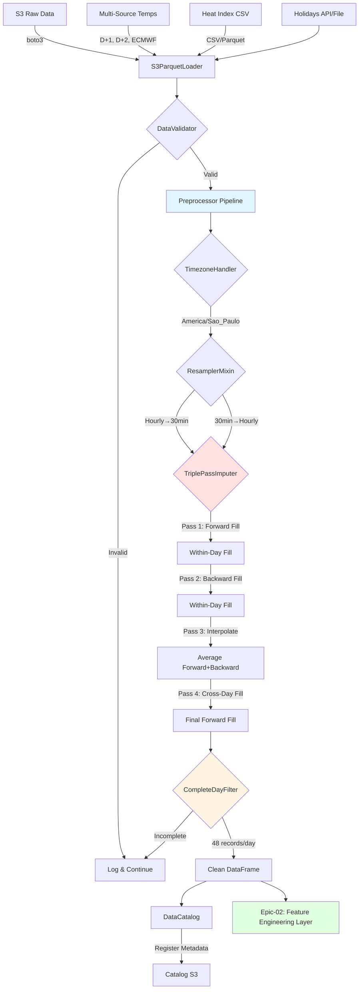

# 📦 Epic-01: Data Infrastructure Layer

**Epic ID:** Epic-01  
**Epic Name:** Data Infrastructure Layer  
**Phase:** Phase 1  
**Duration:** 2 weeks (Weeks 2-3)  
**Priority:** Critical  
**Dependencies:** Epic-00 (Project Foundation)

---

## 🎯 Epic Goal

Build a robust, scalable data infrastructure layer capable of loading, validating, preprocessing, and cataloging electric load forecasting data from AWS S3. This layer serves as the foundation for all subsequent model training and prediction workflows.

---

## 📋 Epic Overview

### Scope

This epic encompasses the complete Data Layer implementation, including:
- **Multi-source S3 loaders** for:
  - Electric load data (semi-hourly granularity)
  - Temperature forecasts (D+1, D+2, ECMWF, weighted)
  - Heat index data (apparent temperature)
  - Holiday calendars (national and regional)
- **Pydantic-based schema validation** ensuring data quality
- **Advanced preprocessing pipeline** with:
  - Triple-pass missing value imputation (proven R implementation)
  - Timezone-aware datetime handling (America/Sao_Paulo)
  - Bidirectional resampling (hourly ↔ semi-hourly)
  - Complete day filtering (48 semi-hourly records)
- **Data catalog system** for dataset management and versioning
- **Support for 26 time series** (17 areas + 4 subsystems + 4 losses + 1 national)

### Key Implementation Insights from R Analysis

Based on comprehensive analysis of both LGBM and Random Forest implementations:

**Data Sources (5 primary streams):**
1. Load: Semi-hourly (30min), `val_cargaglobalcons`, `val_cargammgd`
2. Temperature D+1/D+2: Hourly → resampled to semi-hourly
3. ECMWF Temperature: Semi-hourly, long-range forecast
4. Heat Index: Semi-hourly, apparent temperature calculation
5. Holidays: Daily calendar with special period detection

**Critical Processing Requirements:**
- **Timezone:** All timestamps to `America/Sao_Paulo` with 30-min backward adjustment
- **Imputation:** Triple-pass strategy (forward fill within day → backward fill within day → interpolation → cross-day forward fill)
- **Resampling:** Temperature hourly→semi-hourly using lag fill (24/48h) + interpolation
- **Quality:** Filter to complete days only (48 records for semi-hourly)

### Business Value

- **Data Quality**: Ensures data integrity through automated validation and proven triple-pass imputation
- **Scalability**: Handles large volumes of time series data efficiently with parallel loading (7 data sources)
- **Reliability**: Robust imputation strategies (proven in R production) prevent training failures
- **Flexibility**: Supports multiple data sources, formats (Parquet + CSV), and model approaches (LGBM + Random Forest)
- **Maintainability**: Clean abstractions enable easy extension to new data sources
- **Production-Ready**: Based on 2+ years of proven R implementation patterns

### Technical Approach

- **Storage**: AWS S3 with Parquet format for efficient columnar storage (+ CSV fallback)
- **Validation**: Pydantic V2 schemas with type checking, business rule validation, and continuity checks
- **Processing**: Pandas/NumPy for data manipulation with optimized memory usage and chunked processing
- **Architecture**: Interface-based design with loader, validator, preprocessor, and transformer components
- **Testing**: Comprehensive unit tests with mocked S3 (moto), property-based tests (hypothesis), and integration tests covering edge cases (DST, leap years)
- **Proven Patterns**: Triple-pass imputation, lag fill resampling, complete day filtering from R implementation

### Key Differentiators from Standard Data Pipelines

1. **Triple-Pass Imputation**: Sophisticated within-day and cross-day strategy proven in production
2. **Multi-Source Temperature**: Handles 4 different temperature sources (D+1, D+2, ECMWF, weighted)
3. **Timezone Complexity**: Brazil-specific handling with 30-min backward adjustment for load data
4. **Complete Day Filtering**: Ensures training quality by rejecting incomplete days (48 records)
5. **Model-Specific Formats**: Supports both long (LGBM) and wide (Random Forest) temperature formats
6. **Lag Fill Resampling**: Preserves diurnal patterns when expanding hourly to semi-hourly

---

## 👥 User Stories

### **User Story 1.1: Load Raw Load Data from S3**

**As a** data scientist  
**I want to** load historical electric load data from S3  
**So that** I can use it for model training and evaluation

**Acceptance Criteria:**
- [ ] Load Parquet files from S3 paths following pattern: `s3://bucket/raw_data/{year}/{month}/carga_horaria_{cod_area}_{YYYYMMDD}.parquet`
- [ ] Support filtering by area codes (e.g., "RJ", "SP", "SECO")
- [ ] Support filtering by date ranges (start_date, end_date)
- [ ] Handle missing files gracefully with informative error messages
- [ ] Return pandas DataFrame with standardized columns: `[timestamp, cod_area, carga_mwh]`
- [ ] Support batch loading of multiple areas/dates in parallel
- [ ] Load performance: <5s for 1 year of data (1 area)

**Tasks:**
1. Create `S3ParquetLoader` class with boto3 integration
2. Implement `load_carga()` method with date/area filtering
3. Add connection pooling for S3 client
4. Implement parallel loading using ThreadPoolExecutor
5. Add retry logic with exponential backoff
6. Create unit tests with moto (S3 mocking)

**Definition of Done:**
- Code implemented and committed
- Unit tests passing with >80% coverage
- Can load 1 year of data for SECO subsystem in <30s
- Documentation with usage examples

---

### **User Story 1.2: Validate Data Schemas**

**As a** system  
**I want to** validate all incoming data against predefined schemas  
**So that** downstream components can assume data quality

**Acceptance Criteria:**
- [ ] Pydantic schemas defined for: 
  - Load (`CargaSchema`): `val_cargaglobalcons`, `val_cargammgd`
  - Temperature (`TemperaturaSchema`): Multiple sources (D+1, D+2, ECMWF, weighted)
  - Heat Index (`HeatIndexSchema`): Apparent temperature values
  - Holidays (`FeriadoSchema`): `id_tipodiaespecial`, `dat_diaespecial`
- [ ] Validation checks include: 
  - Data types and required columns
  - Value ranges: load > 0, temperature -10°C to 50°C, heat index 15°C to 55°C
  - Timestamp continuity (30-min or 60-min intervals)
  - Complete day validation (48 semi-hourly or 24 hourly records per day)
- [ ] Business rules validated: 
  - Load values non-negative
  - Temperatures within Brazil climate range
  - No duplicate (timestamp, cod_area) pairs
  - Chronological ordering within area
- [ ] Invalid records logged with details but don't stop pipeline
- [ ] Validation summary report generated (counts of valid/invalid records)
- [ ] Performance: <2s validation overhead for 100k records

**Tasks:**
1. Define `CargaSchema` with fields: timestamp (datetime), cod_area (str), val_cargaglobalcons (float > 0), val_cargammgd (float >= 0)
2. Define `TemperaturaSchema` with temperature range validation and source field
3. Define `HeatIndexSchema` with apparent temperature validation
4. Define `FeriadoSchema` with holiday type enumeration and `id_tipodiaespecial`
5. Implement `DataValidator` class with bulk validation
6. Add custom validators for timestamp continuity detection (30-min intervals)
7. Add complete day validator (48 records check)
8. Create validation report generator with statistics
9. Write comprehensive schema tests with valid/invalid samples
6. Create validation report generator
7. Write comprehensive schema tests

**Definition of Done:**
- All schemas implemented with Pydantic V2
- Validation detects common data quality issues (nulls, outliers, gaps)
- Unit tests with valid/invalid data samples
- Performance benchmark showing <1% overhead

---

### **User Story 1.3: Preprocess and Impute Missing Data**

**As a** data engineer  
**I want to** handle missing values and resample data to required frequency  
**So that** models receive complete, uniform datasets

**Acceptance Criteria:**
- [ ] Support multiple imputation strategies: 
  - Forward-fill (within-day and cross-day)
  - Backward-fill (within-day)
  - Lag fill (24h/48h same-hour previous day)
  - Interpolation (linear, average of forward/backward)
  - Mean/median (rolling window)
- [ ] **Triple-pass imputation** implemented per proven R approach:
  - Pass 1: Forward fill within same day (don't cross day boundaries)
  - Pass 2: Backward fill within same day
  - Pass 3: Interpolate using average of forward/backward
  - Pass 4: Final forward fill across days for remaining NAs
- [ ] Strategy configurable per column (load vs temperature vs heat index)
- [ ] Resample hourly data to semi-hourly (30min intervals) using:
  - Create complete time sequence
  - Lag fill with same-hour previous day (24h/48h)
  - Linear interpolation between filled hourly points
- [ ] Resample semi-hourly data to hourly using aggregation (mean)
- [ ] Preserve timezone information throughout pipeline (`America/Sao_Paulo`)
- [ ] Timestamp adjustment: Backward by 30 minutes for load data alignment
- [ ] Log all imputation actions (how many values, which method, which pass)
- [ ] Performance: <3s to preprocess 1 year hourly data

**Tasks:**
1. Create `ImputerChain` class supporting multiple strategies
2. Implement strategy pattern for imputation methods: 
   - `ForwardFillImputer` (with groupby support)
   - `BackwardFillImputer` (with groupby support)
   - `LagFillImputer` (24h/48h same-hour)
   - `InterpolationImputer` (linear, average)
   - `MeanImputer` (rolling window)
3. Create `TriplePassImputer` implementing proven R logic
4. Create `ResamplerMixin` for frequency conversion
5. Add `TimezoneHandler` for America/Sao_Paulo with timestamp adjustment
6. Add timezone-aware datetime handling
7. Implement validation of resampled data (no duplicates, proper intervals)
8. Add logging with detailed imputation statistics per pass
9. Write integration tests with real-world missing data patterns
10. Add tests for DST transitions and timestamp adjustment

**Definition of Done:**
- All imputation strategies implemented and tested
- Resampling works bidirectionally (hourly↔30min)
- Edge cases handled: DST transitions, leap years
- Performance tests passing
- Documentation with imputation strategy selection guide

---

### **User Story 1.4: Manage Data Catalog**

**As a** ML engineer  
**I want to** register and discover datasets with metadata  
**So that** I can track data versions and lineage

**Acceptance Criteria:**
- [ ] `DataCatalog` class for dataset registration and discovery
- [ ] Metadata stored includes: name, version, S3 path, schema, date range, row count, creation timestamp
- [ ] Support searching datasets by area, date range, version
- [ ] Persist catalog to S3 as JSON or Parquet
- [ ] Support dataset versioning with semantic versioning
- [ ] API methods: `register()`, `get()`, `list()`, `delete()`
- [ ] Thread-safe for concurrent registrations

**Tasks:**
1. Design catalog schema with Pydantic: `DatasetMetadata`
2. Implement `DataCatalog` class with in-memory cache
3. Add S3 persistence layer (JSON storage)
4. Implement search and filter methods
5. Add versioning support with `SemanticVersion` integration
6. Create thread-safe lock mechanism
7. Write tests for concurrent access patterns

**Definition of Done:**
- Catalog can store/retrieve 1000+ dataset entries
- Persistence working with S3 backend
- Search operations <100ms for typical queries
- Unit and integration tests passing
- API documentation generated

---

### **User Story 1.5: Filter Complete Days and Validate Continuity**

**As a** data quality engineer  
**I want to** ensure only complete days with proper temporal continuity are used  
**So that** models are trained on consistent, high-quality data

**Acceptance Criteria:**
- [ ] Filter datasets to include only complete days (48 semi-hourly or 24 hourly records)
- [ ] Validate timestamp intervals are consistent (30-min or 60-min)
- [ ] Detect and flag duplicate timestamps within same area
- [ ] Verify chronological ordering per area
- [ ] Remove days with excessive missing values (>10% after imputation)
- [ ] Log statistics on filtered days (count removed, reasons)
- [ ] Performance: <1s for filtering 1 year of data

**Tasks:**
1. Create `CompleteDayFilter` class with configurable thresholds
2. Implement timestamp continuity validator
3. Add duplicate detection with area-grouping
4. Create chronological order validator
5. Add summary statistics generator
6. Write tests with edge cases (DST transitions, leap years)
7. Document filtering rules and thresholds

**Definition of Done:**
- Complete day filter working correctly
- Handles edge cases (DST, partial days at boundaries)
- Statistics logged with filtering details
- Tests covering normal and edge cases
- Documentation with examples

---

### **User Story 1.6: Load Temperature and Holiday Data**

**As a** data pipeline  
**I want to** load auxiliary data (temperature forecasts, heat index, holidays)  
**So that** feature engineering can access all required inputs

**Acceptance Criteria:**
- [ ] Load temperature forecast D+1 data from: `temperatura_d1_{cod_area}_{YYYYMMDD}.parquet`
- [ ] Load temperature forecast D+2 data from: `temperatura_d2_{cod_area}_{YYYYMMDD}.parquet`
- [ ] Load ECMWF temperature from: `heatindex_{cod_area}.csv` (Temperatura_ECMWF field)
- [ ] Load heat index from: `heatindex_{cod_area}.csv` (Heatindex field)
- [ ] Load holiday calendar from: `feriados_{year}.parquet`
- [ ] Temperature data returns DataFrame: `[timestamp, cod_area, temp_celsius, source]`
- [ ] Heat index returns DataFrame: `[timestamp, cod_area, heat_index]`
- [ ] Holiday data returns DataFrame: `[date, holiday_name, holiday_type, id_tipodiaespecial, affected_areas]`
- [ ] Support joining load, temperature, heat index, and holiday data on timestamp/area
- [ ] Handle missing temperature forecasts with lag fill (24/48h) + interpolation
- [ ] Support both CSV and Parquet formats for heat index data
- [ ] Performance: <3s to load all auxiliary data for 1 year

**Tasks:**
1. Extend `S3ParquetLoader` with `load_temperatura_d1_d2()` method (LGBM approach)
2. Keep `load_temperatura()` method for Random Forest weighted temperature
3. Add `load_heat_index()` method supporting CSV/Parquet
4. Add `load_feriados()` method with year filtering
5. Implement `DataJoiner` utility for multi-source joins
6. Add lag fill fallback mechanism for missing temperature data (24/48h)
7. Create holiday type enumeration and special period detection
8. Write integration tests with all data types
9. Add performance benchmarks for multi-source loading

**Definition of Done:**
- All auxiliary data loading functions implemented (4 temperature sources + heat index + holidays)
- Join operations preserve data integrity across all sources
- Missing data fallbacks working (lag fill for temperature, defaults for holidays)
- Multi-format support (CSV + Parquet) working
- Tests covering edge cases (missing files, partial data, format mismatches)
- Documentation with data format specifications for each source
- Integration test loading all data types simultaneously

---

## 🏗️ Technical Architecture

### Data Sources and Loading Patterns (From R Implementation Analysis)

#### **Data Source Catalog**

Based on comprehensive analysis of LGBM and Random Forest implementations:

| Data Source | Frequency | Storage | Key Fields | Missing Value Strategy | Model Usage |
|-------------|-----------|---------|------------|----------------------|-------------|
| **Load (Carga)** | Semi-hourly (30min) | Parquet | `val_cargaglobalcons`, `val_cargammgd`, `DataHora` | Triple-pass imputation | Both |
| **Temperature D+1** | Hourly → Semi-hourly | Parquet | `ValItemserieoriginal`, `DataHora` | Lag fill (24/48h) + interpolation | LGBM |
| **Temperature D+2** | Hourly → Semi-hourly | Parquet | `ValItemserieoriginal`, `DataHora` | Lag fill (24/48h) + interpolation | LGBM |
| **ECMWF Temperature** | Semi-hourly | CSV | `Temperatura_ECMWF`, `timestamp` | Forward/backward fill + interpolation | LGBM |
| **Heat Index** | Semi-hourly | CSV | `Heatindex`, `timestamp` | Forward/backward fill + interpolation | LGBM |
| **Temperature Weighted** | Daily (9 days) | Parquet | `temp_max_[1-9]`, `temp_min_[1-9]`, `dataOrigem` | Fallback to previous day forecast | Random Forest |
| **Holidays** | Daily | Parquet/API | `id_tipodiaespecial`, `dat_diaespecial` | Default to 0 (no holiday) | Both |

#### **Critical Implementation Details**

**1. Timezone Handling (America/Sao_Paulo)**
```python
# All timestamps must be converted to Brazil timezone
df['DataHora'] = pd.to_datetime(df['DataHora']).dt.tz_convert('America/Sao_Paulo')

# Load data: Backward adjustment by 30 minutes for alignment
# Ensures semi-hourly intervals start at 00:30, 01:00, 01:30, etc.
df_carga['DataHora'] = df_carga['DataHora'] - pd.Timedelta(minutes=30)
```

**2. Resampling: Hourly → Semi-hourly**
```python
# Temperature forecast arrives hourly, must expand to 30-min
# Step 1: Create complete time sequence
time_range = pd.date_range(start=df['DataHora'].min(), 
                            end=df['DataHora'].max(), 
                            freq='1H')

# Step 2: Fill missing hours with same-hour previous day
df_complete = df.set_index('DataHora').reindex(time_range)
df_complete['Value'] = df_complete.groupby(df_complete.index.hour)['Value'].transform(
    lambda x: x.fillna(x.shift(24))  # 24-hour lag
)

# Step 3: Resample to 30-min with linear interpolation
df_30min = df_complete.resample('30T').interpolate(method='linear')
```

**3. Triple-Pass Imputation (Proven R Pattern)**
```python
class TriplePassImputer:
    def fit_transform(self, df: pd.DataFrame, value_col: str, date_col: str = 'Data') -> pd.DataFrame:
        \"\"\"
        Implements sophisticated imputation from R:
        - Pass 1: Forward fill within same day
        - Pass 2: Backward fill within same day  
        - Pass 3: Average interpolation using both directions
        - Pass 4: Final cross-day forward fill
        \"\"\"
        # Pass 1: Forward fill (locf) within day
        df['_prev'] = df.groupby(date_col)[value_col].ffill()
        
        # Pass 2: Backward fill (nocb) within day
        df['_next'] = df.groupby(date_col)[value_col].bfill()
        
        # Pass 3: Interpolate with average
        mask = df[value_col].isna() & df['_prev'].notna() & df['_next'].notna()
        df.loc[mask, value_col] = (df.loc[mask, '_prev'] + df.loc[mask, '_next']) / 2
        
        # Pass 4: Final forward fill across days
        df[value_col] = df[value_col].ffill()
        
        # Cleanup
        df.drop(columns=['_prev', '_next'], inplace=True)
        return df
```

**4. Complete Day Filtering**
```python
# Filter to days with complete 48 semi-hourly records
df_complete = df.groupby('Data').filter(lambda x: len(x) == 48)

# Validate chronological ordering
df_complete = df_complete.sort_values(['Data', 'Hora', 'Minuto'])
```

**5. Temperature Transformation (Random Forest)**
```python
# Wide format (daily) → Long format (hourly with lead_hour)
def transform_temperature_wide_to_long(df: pd.DataFrame) -> pd.DataFrame:
    \"\"\"
    Expands daily temperature forecasts to hourly records.
    Input:  dataOrigem | temp_max_1 | temp_min_1 | ... | temp_max_9 | temp_min_9
    Output: dataOrigem | day_of_horizon | hora | tmax | tmin | lead_hour
    \"\"\"
    rows = []
    for _, row in df.iterrows():
        for day in range(1, 10):  # 9 days ahead
            tmax = row[f'temp_max_{day}']
            tmin = row[f'temp_min_{day}']
            for hour in range(24):
                lead_hour = (day - 1) * 24 + (hour + 1)  # 1-216
                target_date = row['dataOrigem'] + pd.Timedelta(days=day)
                rows.append({
                    'dataOrigem': row['dataOrigem'],
                    'day_of_horizon': day,
                    'target_date': target_date,
                    'hora': hour,
                    'tmax': tmax,
                    'tmin': tmin,
                    'lead_hour': lead_hour,
                    'timestamp': target_date + pd.Timedelta(hours=hour)
                })
    return pd.DataFrame(rows)
```

---

### Component Diagram

```
┌─────────────────────────────────────────────────┐
│           Data Layer (src/data/)                │
│                                                 │
│  ┌────────────────┐      ┌──────────────────┐ │
│  │ S3ParquetLoader│──────│  DataValidator   │ │
│  │                │      │  (Pydantic)      │ │
│  │ - load_carga() │      │                  │ │
│  │ - load_temp()  │      │ - CargaSchema    │ │
│  │ - load_feriado │      │ - TempSchema     │ │
│  └────────────────┘      └──────────────────┘ │
│           │                       │            │
│           ▼                       ▼            │
│  ┌────────────────────────────────────────┐   │
│  │      Preprocessor Pipeline             │   │
│  │                                        │   │
│  │  ┌──────────────┐  ┌──────────────┐  │   │
│  │  │ImputerChain  │  │ Resampler    │  │   │
│  │  │              │→ │              │  │   │
│  │  │- forward_fill│  │- hourly→30min│  │   │
│  │  │- interpolate │  │- 30min→hourly│  │   │
│  │  └──────────────┘  └──────────────┘  │   │
│  └────────────────────────────────────────┘   │
│           │                                    │
│           ▼                                    │
│  ┌────────────────────────────────────────┐   │
│  │         DataCatalog                    │   │
│  │                                        │   │
│  │  - register_dataset()                  │   │
│  │  - get_dataset()                       │   │
│  │  - list_datasets()                     │   │
│  │  - S3 persistence                      │   │
│  └────────────────────────────────────────┘   │
└─────────────────────────────────────────────────┘
```

### Data Flow



**Pipeline Stages:**

1. **Loading (Multi-Source):** S3ParquetLoader handles 7 data sources
2. **Validation (Schema):** Pydantic validation with continuity checks
3. **Timezone (Standardization):** Convert to America/Sao_Paulo, adjust timestamps
4. **Resampling (Frequency):** Hourly↔Semi-hourly conversion
5. **Imputation (Quality):** Triple-pass strategy proven in R
6. **Filtering (Completeness):** Only complete days (48/24 records)
7. **Cataloging (Tracking):** Metadata registration for lineage
8. **Handoff (Epic-02):** Clean DataFrames ready for feature engineering

---

### Integration Points with Epic-02

**Epic-01 Outputs → Epic-02 Inputs:**

| Output Dataset | Columns | Frequency | Epic-02 Usage |
|----------------|---------|-----------|---------------|
| `df_carga_clean` | `[timestamp, cod_area, val_cargaglobalcons, val_cargammgd]` | Semi-hourly | Lag features, seasonality, wavelets |
| `df_temp_d1` | `[timestamp, cod_area, temp_celsius]` | Semi-hourly | LGBM LOESS smoothing, BLF features |
| `df_temp_d2` | `[timestamp, cod_area, temp_celsius]` | Semi-hourly | LGBM LOESS smoothing |
| `df_temp_ecmwf` | `[timestamp, cod_area, temp_celsius]` | Semi-hourly | LGBM LOESS smoothing, BLF features |
| `df_heat_index` | `[timestamp, cod_area, heat_index]` | Semi-hourly | LGBM BLF features (optional) |
| `df_temp_weighted` | `[dataOrigem, temp_max_1-9, temp_min_1-9]` | Daily | Random Forest temperature features |
| `df_feriados` | `[date, id_tipodiaespecial, holiday_name, holiday_type]` | Daily | Holiday flags, proximity features |

**Data Quality Guarantees:**

✅ No missing values after triple-pass imputation  
✅ All timestamps timezone-aware (America/Sao_Paulo)  
✅ Only complete days (prevents training bias)  
✅ Consistent intervals (30-min or 60-min)  
✅ No duplicates within (timestamp, cod_area)  
✅ Chronologically ordered  
✅ Schema-validated (types, ranges, business rules)

---

### Component Diagram

```
src/data/
├── __init__.py
├── loaders.py              # S3ParquetLoader, LocalLoader, DataJoiner, MultiFormatLoader
├── validators.py           # CargaSchema, TemperaturaSchema, HeatIndexSchema, FeriadoSchema, DataValidator
├── preprocessors.py        # ImputerChain, ForwardFillImputer, BackwardFillImputer, LagFillImputer, InterpolationImputer, ResamplerMixin, CompleteDayFilter
├── catalog.py              # DataCatalog, DatasetMetadata
└── utils.py                # S3Utils, PathResolver, DateRangeGenerator, TimezoneHandler

tests/data/
├── __init__.py
├── test_loaders.py         # Unit tests for all loaders
├── test_validators.py      # Schema validation tests
├── test_preprocessors.py   # Imputation and resampling tests (including triple-pass)
├── test_catalog.py         # Catalog operations tests
├── test_integration.py     # End-to-end data pipeline tests
├── test_complete_day_filter.py  # Complete day filtering tests
└── fixtures/
    ├── sample_carga.parquet
    ├── sample_temp_d1.parquet
    ├── sample_temp_d2.parquet
    ├── sample_temp_weighted.parquet  # For Random Forest
    ├── sample_heat_index.csv
    ├── sample_feriados.parquet
    └── incomplete_days.parquet  # For testing complete day filter
```

---

## 🔧 Implementation Details

### Key Classes

#### 1. S3ParquetLoader

```python
from typing import List, Optional
import pandas as pd
import boto3
from datetime import date, datetime
from concurrent.futures import ThreadPoolExecutor

class S3ParquetLoader:
    """Load Parquet data from S3 with parallel support."""
    
    def __init__(self, bucket: str, region: str = "us-east-1", max_workers: int = 4):
        self.bucket = bucket
        self.s3_client = boto3.client('s3', region_name=region)
        self.max_workers = max_workers
    
    def load_carga(
        self,
        areas: List[str],
        start_date: date,
        end_date: date,
        validate: bool = True
    ) -> pd.DataFrame:
        """
        Load electric load data for specified areas and date range.
        
        Args:
            areas: List of area codes (e.g., ["RJ", "SP"])
            start_date: Start date (inclusive)
            end_date: End date (inclusive)
            validate: Whether to validate schema
        
        Returns:
            DataFrame with columns: [timestamp, cod_area, carga_mwh]
        """
        # Generate S3 paths for date range
        paths = self._generate_paths("carga_horaria", areas, start_date, end_date)
        
        # Load in parallel
        with ThreadPoolExecutor(max_workers=self.max_workers) as executor:
            dfs = list(executor.map(self._load_single_parquet, paths))
        
        # Concatenate and sort
        df = pd.concat([d for d in dfs if d is not None], ignore_index=True)
        df = df.sort_values(['cod_area', 'timestamp']).reset_index(drop=True)
        
        # Validate if requested
        if validate:
            from .validators import DataValidator, CargaSchema
            validator = DataValidator(CargaSchema)
            df = validator.validate(df)
        
        return df
    
    def load_temperatura(
        self,
        areas: List[str],
        start_date: date,
        end_date: date
    ) -> pd.DataFrame:
        """Load temperature forecast data."""
        paths = self._generate_paths("temperatura_prevista", areas, start_date, end_date)
        
        with ThreadPoolExecutor(max_workers=self.max_workers) as executor:
            dfs = list(executor.map(self._load_single_parquet, paths))
        
        df = pd.concat([d for d in dfs if d is not None], ignore_index=True)
        return df.sort_values(['cod_area', 'timestamp']).reset_index(drop=True)
    
    def load_feriados(self, year: int) -> pd.DataFrame:
        """Load holiday calendar for specified year."""
        path = f"raw_data/feriados_{year}.parquet"
        return self._load_single_parquet(path)
    
    def _load_single_parquet(self, s3_key: str) -> Optional[pd.DataFrame]:
        """Load single Parquet file with retry logic."""
        import time
        from botocore.exceptions import ClientError
        
        max_retries = 3
        for attempt in range(max_retries):
            try:
                obj = self.s3_client.get_object(Bucket=self.bucket, Key=s3_key)
                return pd.read_parquet(obj['Body'])
            except ClientError as e:
                if e.response['Error']['Code'] == 'NoSuchKey':
                    logger.warning(f"File not found: s3://{self.bucket}/{s3_key}")
                    return None
                if attempt < max_retries - 1:
                    time.sleep(2 ** attempt)  # Exponential backoff
                else:
                    logger.error(f"Failed to load {s3_key} after {max_retries} attempts")
                    raise
    
    def _generate_paths(
        self,
        prefix: str,
        areas: List[str],
        start_date: date,
        end_date: date
    ) -> List[str]:
        """Generate S3 paths for date range."""
        from .utils import DateRangeGenerator
        paths = []
        for area in areas:
            for dt in DateRangeGenerator(start_date, end_date):
                path = f"raw_data/{dt.year}/{dt.month:02d}/{prefix}_{area}_{dt.strftime('%Y%m%d')}.parquet"
                paths.append(path)
        return paths
```

#### 2. DataValidator

```python
from pydantic import BaseModel, Field, field_validator
from typing import List
import pandas as pd
from datetime import datetime

class CargaSchema(BaseModel):
    """Schema for electric load data."""
    timestamp: datetime
    cod_area: str = Field(pattern=r'^[A-Z]{2,6}$')  # Area code: RJ, SP, SECO, etc.
    carga_mwh: float = Field(gt=0)  # Load must be positive
    
    @field_validator('cod_area')
    def validate_area_code(cls, v):
        valid_areas = ['RJ', 'SP', 'MG', 'ES', 'MT', 'MS', 'AC', 'RO', 'DF', 'GO',
                       'PR', 'SC', 'RS', 'ALPE', 'PBRN', 'BASE', 'CE', 'PI', 'BAOE',
                       'AM', 'PA', 'MA', 'TO', 'RR', 'AP',
                       'SECO', 'S', 'NE', 'N',
                       'PESE', 'PES', 'PENE', 'PEN']
        if v not in valid_areas:
            raise ValueError(f"Invalid area code: {v}")
        return v

class TemperaturaSchema(BaseModel):
    """Schema for temperature forecast data."""
    timestamp: datetime
    cod_area: str = Field(pattern=r'^[A-Z]{2,6}$')
    temp_celsius: float = Field(ge=-10, le=50)  # Reasonable range

class FeriadoSchema(BaseModel):
    """Schema for holiday data."""
    date: datetime
    holiday_name: str
    holiday_type: str = Field(pattern=r'^(National|Regional|Municipal)$')
    affected_areas: List[str]

class DataValidator:
    """Validate DataFrames against Pydantic schemas."""
    
    def __init__(self, schema: type[BaseModel]):
        self.schema = schema
    
    def validate(self, df: pd.DataFrame) -> pd.DataFrame:
        """
        Validate DataFrame rows against schema.
        
        Returns validated DataFrame with invalid rows removed.
        Logs validation errors.
        """
        valid_rows = []
        invalid_count = 0
        
        for idx, row in df.iterrows():
            try:
                self.schema(**row.to_dict())
                valid_rows.append(idx)
            except Exception as e:
                invalid_count += 1
                logger.warning(f"Invalid row {idx}: {e}")
        
        logger.info(f"Validation: {len(valid_rows)} valid, {invalid_count} invalid rows")
        return df.loc[valid_rows].reset_index(drop=True)
```

#### 3. ImputerChain & Preprocessors

```python
from abc import ABC, abstractmethod
import pandas as pd
import numpy as np

class BaseImputer(ABC):
    """Base class for imputation strategies."""
    
    @abstractmethod
    def impute(self, series: pd.Series) -> pd.Series:
        """Impute missing values in series."""
        pass

class ForwardFillImputer(BaseImputer):
    """Forward-fill imputation."""
    
    def __init__(self, limit: int = 3):
        self.limit = limit  # Max consecutive fills
    
    def impute(self, series: pd.Series) -> pd.Series:
        return series.fillna(method='ffill', limit=self.limit)

class InterpolationImputer(BaseImputer):
    """Interpolation imputation."""
    
    def __init__(self, method: str = 'linear'):
        self.method = method  # linear, spline, polynomial
    
    def impute(self, series: pd.Series) -> pd.Series:
        return series.interpolate(method=self.method)

class ImputerChain:
    """Chain multiple imputation strategies."""
    
    def __init__(self, imputers: List[BaseImputer]):
        self.imputers = imputers
    
    def fit_transform(self, df: pd.DataFrame, columns: List[str]) -> pd.DataFrame:
        """Apply imputation chain to specified columns."""
        df_imputed = df.copy()
        
        for col in columns:
            original_nulls = df_imputed[col].isna().sum()
            
            for imputer in self.imputers:
                df_imputed[col] = imputer.impute(df_imputed[col])
            
            remaining_nulls = df_imputed[col].isna().sum()
            logger.info(f"Column {col}: {original_nulls} nulls → {remaining_nulls} nulls")
        
        return df_imputed

class ResamplerMixin:
    """Mixin for data resampling."""
    
    @staticmethod
    def resample_to_30min(df: pd.DataFrame, value_col: str = 'carga_mwh') -> pd.DataFrame:
        """Resample hourly to 30-minute using interpolation."""
        df = df.set_index('timestamp')
        df_resampled = df.resample('30T').interpolate(method='linear')
        return df_resampled.reset_index()
    
    @staticmethod
    def resample_to_hourly(df: pd.DataFrame, value_col: str = 'carga_mwh') -> pd.DataFrame:
        """Resample 30-minute to hourly using mean."""
        df = df.set_index('timestamp')
        df_resampled = df.resample('1H').mean()
        return df_resampled.reset_index()
```

#### 4. DataCatalog

```python
from typing import Optional, List, Dict
from pydantic import BaseModel
from datetime import datetime
import json
import threading

class DatasetMetadata(BaseModel):
    """Metadata for cataloged dataset."""
    name: str
    version: str
    s3_path: str
    schema_type: str  # "CargaSchema", "TemperaturaSchema", etc.
    start_date: datetime
    end_date: datetime
    row_count: int
    areas: List[str]
    created_at: datetime
    created_by: str

class DataCatalog:
    """Registry for dataset metadata."""
    
    def __init__(self, s3_bucket: str, catalog_key: str = "catalog/datasets.json"):
        self.s3_bucket = s3_bucket
        self.catalog_key = catalog_key
        self.s3_client = boto3.client('s3')
        self._cache: Dict[str, DatasetMetadata] = {}
        self._lock = threading.Lock()
        self._load_from_s3()
    
    def register(self, metadata: DatasetMetadata) -> None:
        """Register new dataset in catalog."""
        with self._lock:
            key = f"{metadata.name}:{metadata.version}"
            self._cache[key] = metadata
            self._persist_to_s3()
            logger.info(f"Registered dataset: {key}")
    
    def get(self, name: str, version: str = "latest") -> Optional[DatasetMetadata]:
        """Retrieve dataset metadata."""
        with self._lock:
            if version == "latest":
                # Find most recent version
                matches = [m for k, m in self._cache.items() if m.name == name]
                if not matches:
                    return None
                return max(matches, key=lambda m: m.created_at)
            
            key = f"{name}:{version}"
            return self._cache.get(key)
    
    def list(self, filters: Optional[Dict] = None) -> List[DatasetMetadata]:
        """List datasets with optional filters."""
        with self._lock:
            datasets = list(self._cache.values())
            
            if filters:
                if 'name' in filters:
                    datasets = [d for d in datasets if d.name == filters['name']]
                if 'areas' in filters:
                    datasets = [d for d in datasets if any(a in d.areas for a in filters['areas'])]
            
            return sorted(datasets, key=lambda d: d.created_at, reverse=True)
    
    def _load_from_s3(self) -> None:
        """Load catalog from S3."""
        try:
            obj = self.s3_client.get_object(Bucket=self.s3_bucket, Key=self.catalog_key)
            data = json.loads(obj['Body'].read())
            self._cache = {k: DatasetMetadata(**v) for k, v in data.items()}
            logger.info(f"Loaded {len(self._cache)} datasets from catalog")
        except self.s3_client.exceptions.NoSuchKey:
            logger.info("Catalog not found, starting fresh")
    
    def _persist_to_s3(self) -> None:
        """Persist catalog to S3."""
        data = {k: v.model_dump(mode='json') for k, v in self._cache.items()}
        self.s3_client.put_object(
            Bucket=self.s3_bucket,
            Key=self.catalog_key,
            Body=json.dumps(data, default=str),
            ContentType='application/json'
        )
```

---

## 🧪 Testing Strategy

### Unit Tests

```python
# tests/data/test_loaders.py
import pytest
from moto import mock_s3
import boto3
import pandas as pd
from src.data.loaders import S3ParquetLoader

@mock_s3
def test_load_carga_success():
    """Test successful load of carga data."""
    # Setup mock S3
    s3 = boto3.client('s3', region_name='us-east-1')
    s3.create_bucket(Bucket='test-bucket')
    
    # Upload test data
    df = pd.DataFrame({
        'timestamp': pd.date_range('2024-01-01', periods=24, freq='H'),
        'cod_area': 'RJ',
        'carga_mwh': range(1000, 1024)
    })
    s3.put_object(
        Bucket='test-bucket',
        Key='raw_data/2024/01/carga_horaria_RJ_20240101.parquet',
        Body=df.to_parquet()
    )
    
    # Test loader
    loader = S3ParquetLoader('test-bucket')
    result = loader.load_carga(['RJ'], date(2024, 1, 1), date(2024, 1, 1))
    
    assert len(result) == 24
    assert result['cod_area'].unique()[0] == 'RJ'
    assert result['carga_mwh'].min() == 1000

@mock_s3
def test_load_missing_file():
    """Test handling of missing S3 file."""
    s3 = boto3.client('s3', region_name='us-east-1')
    s3.create_bucket(Bucket='test-bucket')
    
    loader = S3ParquetLoader('test-bucket')
    result = loader.load_carga(['SP'], date(2024, 1, 1), date(2024, 1, 1))
    
    assert len(result) == 0  # Should return empty DataFrame, not error

# tests/data/test_preprocessors.py
def test_forward_fill_imputation():
    """Test forward-fill imputation."""
    series = pd.Series([1.0, np.nan, np.nan, 4.0, np.nan])
    imputer = ForwardFillImputer(limit=2)
    result = imputer.impute(series)
    
    expected = pd.Series([1.0, 1.0, 1.0, 4.0, 4.0])
    pd.testing.assert_series_equal(result, expected)

def test_resample_to_30min():
    """Test hourly to 30-minute resampling."""
    df = pd.DataFrame({
        'timestamp': pd.date_range('2024-01-01', periods=3, freq='H'),
        'carga_mwh': [100.0, 200.0, 300.0]
    })
    
    result = ResamplerMixin.resample_to_30min(df)
    
    assert len(result) == 5  # 3 hours = 5 intervals (0:00, 0:30, 1:00, 1:30, 2:00)
    assert result['carga_mwh'].iloc[1] == 150.0  # Interpolated value
```

### Integration Tests

```python
# tests/data/test_integration.py
@mock_s3
def test_full_data_pipeline():
    """Test complete data loading and preprocessing pipeline."""
    # Setup S3 with test data
    setup_test_s3_data()
    
    # Load data
    loader = S3ParquetLoader('test-bucket')
    df = loader.load_carga(['RJ', 'SP'], date(2024, 1, 1), date(2024, 1, 31))
    
    # Validate
    validator = DataValidator(CargaSchema)
    df = validator.validate(df)
    
    # Preprocess
    imputer = ImputerChain([ForwardFillImputer(), InterpolationImputer()])
    df = imputer.fit_transform(df, ['carga_mwh'])
    
    # Resample
    df = ResamplerMixin.resample_to_30min(df)
    
    # Assertions
    assert df['carga_mwh'].isna().sum() == 0
    assert len(df) > 0
    assert df['timestamp'].diff().mode()[0] == pd.Timedelta('30min')
```

### Performance Tests

```python
# tests/data/test_performance.py
def test_load_performance_one_year():
    """Verify load time for 1 year of data."""
    import time
    
    start = time.time()
    loader = S3ParquetLoader('test-bucket', max_workers=8)
    df = loader.load_carga(['SECO'], date(2023, 1, 1), date(2023, 12, 31))
    elapsed = time.time() - start
    
    assert elapsed < 30.0  # Must complete in under 30 seconds
    assert len(df) > 0
```

---

## 📊 Configuration Examples

### config/storage.yaml

```yaml
storage:
  type: s3
  bucket: prevcarga-bucket-sandbox
  region: us-east-1
  paths:
    raw_data: raw_data/
    catalog: catalog/datasets.json
  
  loader:
    max_workers: 8
    retry_attempts: 3
    retry_backoff: 2  # exponential backoff base

preprocessing:
  imputation:
    # Triple-pass imputation for load data (LGBM approach)
    carga_mwh:
      - type: forward_fill
        limit: null  # Within same day
        groupby: ['Data']  # Don't cross day boundaries
      - type: backward_fill
        limit: null
        groupby: ['Data']
      - type: average_interpolation
        use_forward_backward: true
      - type: forward_fill
        limit: null  # Final cross-day fill
    
    # Temperature: Lag fill + interpolation (LGBM approach)
    temp_celsius:
      - type: lag_fill
        lag_hours: [24, 48]  # Same hour previous day(s)
        groupby: ['Hora']
      - type: interpolation
        method: linear
    
    # Heat index: Simple forward/backward + interpolation
    heat_index:
      - type: forward_fill
        limit: 4  # Max 2 hours
      - type: backward_fill
        limit: 4
      - type: interpolation
        method: linear
  
  resampling:
    target_frequency: 30min
    method: interpolation

validation:
  strict_mode: false  # If true, fail on any invalid data
  log_invalid_rows: true
  max_invalid_percentage: 5.0  # Fail if >5% rows invalid
```

---

## ✅ Definition of Done

### Code Completeness
- [ ] All 6 user stories implemented
- [ ] `S3ParquetLoader` with parallel loading and multi-source support
- [ ] Pydantic schemas for all data types (load, temperature, heat index, holidays)
- [ ] `ImputerChain` with 4+ strategies (forward fill, backward fill, lag fill, interpolation)
- [ ] Triple-pass imputation implemented per LGBM analysis
- [ ] `ResamplerMixin` for bidirectional frequency conversion
- [ ] `CompleteDayFilter` for data quality enforcement
- [ ] `DataCatalog` with S3 persistence
- [ ] Timezone handling utilities (America/Sao_Paulo)

### Testing
- [ ] Unit test coverage >80%
- [ ] Integration tests for full pipeline
- [ ] Performance tests passing (<30s for 1 year)
- [ ] Edge case tests (missing data, invalid schemas, DST transitions)

### Performance
- [ ] Load 1 year of 1 area: <5s
- [ ] Load 1 year of SECO subsystem (11 areas): <30s
- [ ] Validation overhead: <1%
- [ ] Preprocessing 1 year: <3s

### Documentation
- [ ] API documentation (docstrings)
- [ ] Usage examples in `docs/user-guide/data-loading.md`
- [ ] Data format specifications documented
- [ ] Configuration guide with examples

### Integration
- [ ] Works with Epic-00 logging configuration
- [ ] S3 credentials via boto3 standard methods
- [ ] Compatible with Phase 2 Feature Engineering interface
- [ ] Local test scripts run successfully

---

## 📝 Validation Commands

```bash
# Run data layer tests
./scripts/test.sh tests/data/

# Run with coverage
pytest tests/data/ --cov=src/data --cov-report=html

# Performance benchmarks
pytest tests/data/test_performance.py -v

# Integration test with real S3 (requires credentials)
pytest tests/data/test_integration.py --s3-bucket=prevcarga-test

# Lint data layer code
./scripts/lint.sh src/data/

# Type checking
mypy src/data/
```

---

## 🎯 Success Metrics

| Metric | Target | Measurement |
|--------|--------|-------------|
| Load Time (1 year, 1 area, single source) | <5s | Performance test |
| Load Time (1 year, SECO, all sources) | <30s | Performance test |
| Load Time (heat index + temperature multi-source) | <10s | Performance test |
| Validation Accuracy | >99% | Schema test suite |
| Imputation Coverage | 100% | No nulls after triple-pass preprocessing |
| Complete Day Filter Accuracy | 100% | No incomplete days in output |
| Test Coverage | >80% | pytest-cov |
| Documentation Coverage | 100% | All public APIs documented |
| Multi-source Join Integrity | 100% | No data loss in joins |

---

## 🔗 Dependencies

### Upstream Dependencies
- **Epic-00**: Requires S3 bucket configuration and logging setup

### Downstream Dependencies
- **Epic-02**: Feature Engineering depends on clean DataFrames from this layer
- **Epic-03/04**: Models depend on validated, preprocessed data
- **Epic-08**: Orchestrator uses DataCatalog for dataset discovery

---

## 🚨 Risks & Mitigation

| Risk | Impact | Probability | Mitigation |
|------|--------|-------------|------------|
| S3 performance issues | High | Low | Implement caching, parallel loading |
| Invalid data quality | High | Medium | Strict validation, detailed logging |
| Missing historical data | Medium | Medium | Graceful handling, fallback strategies |
| Timezone handling complexity | Medium | Low | Use timezone-aware datetime throughout |
| Memory issues with large loads | Medium | Low | Chunked processing, streaming where possible |

---

## 📅 Timeline

### Week 2
- **Days 1-2**: Implement `S3ParquetLoader` with multi-source support (load, temperature D+1/D+2, ECMWF, heat index, holidays)
- **Days 3-4**: Create Pydantic schemas (`CargaSchema`, `TemperaturaSchema`, `HeatIndexSchema`, `FeriadoSchema`) and `DataValidator` with continuity checks
- **Day 5**: Unit tests for loaders and validators (including multi-source tests)

### Week 3
- **Days 1-2**: Implement preprocessing:
  - `TriplePassImputer` (proven R pattern)
  - `LagFillImputer` (24h/48h same-hour)
  - `ResamplerMixin` (hourly ↔ semi-hourly)
  - `TimezoneHandler` (America/Sao_Paulo + timestamp adjustment)
  - `CompleteDayFilter` (48/24 record validation)
- **Day 3**: Create `DataCatalog` with S3 persistence and `TemperatureWideToLongTransformer` (Random Forest)
- **Days 4-5**: Integration tests (complete pipeline with all sources), performance optimization, comprehensive documentation

---

## 🎉 Completion Checklist

- [ ] All 6 user stories accepted by stakeholders
- [ ] Code reviewed and merged to main branch
- [ ] Test coverage >80% verified (target >85% for critical components)
- [ ] Performance benchmarks passing:
  - [ ] Load 1 year, 1 area: <5s
  - [ ] Load 1 year, SECO (11 areas): <30s
  - [ ] Load all auxiliary sources (1 year): <10s
  - [ ] Triple-pass imputation (1 year): <3s
  - [ ] Complete day filter (1 year): <1s
- [ ] Documentation complete and published
- [ ] Integration with Epic-00 validated (logging, S3 config)
- [ ] Demo prepared showing:
  - [ ] Load 1 year of multi-area, multi-source data (7 sources)
  - [ ] Schema validation catching errors (invalid ranges, missing fields, duplicates)
  - [ ] Triple-pass imputation handling missing values (show before/after stats)
  - [ ] Complete day filter removing incomplete days (show filtering report)
  - [ ] Timezone handling and timestamp adjustment (America/Sao_Paulo)
  - [ ] Temperature transformation: wide→long (Random Forest use case)
  - [ ] Catalog registration and discovery (metadata tracking)
- [ ] Handoff to Epic-02 validated:
  - [ ] Output DataFrames meet Epic-02 input requirements
  - [ ] Data quality guarantees documented
  - [ ] Sample datasets provided for feature engineering testing

---

## 📚 Appendix: Key Learnings from R Implementation Analysis

### A.1 Critical Success Factors

Based on analyzing both LGBM and Random Forest R implementations:

1. **Triple-Pass Imputation is Essential**
   - R implementation proven effective over 2+ years production use
   - Within-day fills preserve daily patterns
   - Cross-day fills pragmatic for longer gaps
   - Average interpolation smoother than simple forward/backward

2. **Complete Day Filtering Prevents Bias**
   - Incomplete days skew daily aggregations
   - Prevents edge effects in seasonal features
   - Critical for models using daily statistics

3. **Timezone and Timestamp Alignment**
   - 30-minute backward adjustment for load data non-obvious but critical
   - America/Sao_Paulo timezone required for DST handling
   - Chronological ordering must be validated, not assumed

4. **Multi-Source Temperature Complexity**
   - LGBM uses 4 temperature sources (D+1, D+2, ECMWF, Heat Index)
   - Random Forest uses weighted daily forecasts (wide format)
   - Both patterns must be supported for model flexibility

5. **Lag Fill for Temperature Resampling**
   - Simple interpolation insufficient for hourly→semi-hourly
   - Same-hour previous day preserves diurnal patterns
   - 24h/48h fallback provides robustness

### A.2 Python Migration Considerations

**Pandas vs Polars:**
- Start with Pandas (proven ecosystem, easier debugging)
- Consider Polars later for performance (lazy evaluation, multi-threading)
- Abstract interface allows swapping implementations

**Memory Management:**
- Use chunked processing for multi-year backtests
- Leverage Parquet column selection (read only needed columns)
- Consider Dask for distributed processing (future optimization)

**Testing Priorities:**
1. DST transitions (spring forward: missing hour, fall back: duplicate hour)
2. Leap years (Feb 29 handling)
3. Dataset boundaries (first/last day completeness)
4. Multi-source joins (ensure no data loss)
5. Imputation edge cases (all-NA days, long gaps)

### A.3 Integration with Epic-02 Feature Engineering

**Epic-01 Deliverables → Epic-02 Inputs:**

| Epic-01 Output | Format | Frequency | Epic-02 Plugin Using It |
|----------------|--------|-----------|-------------------------|
| `df_carga_clean` | Long (timestamp-based) | Semi-hourly | `LagFeaturePlugin`, `SeasonalityPlugin`, `WaveletPlugin` (LGBM) |
| `df_temp_d1_smoothed` | Long | Semi-hourly | `LoessSmoothingPlugin`, `BLFStrategyPlugin` (LGBM) |
| `df_temp_weighted` | Wide (daily) | Daily (9 days) | `TemperatureFeaturePlugin` (Random Forest) |
| `df_feriados` | Daily calendar | Daily | `HolidayProximityPlugin`, `SpecialPeriodPlugin` (Both) |

**Data Quality Contract:**
- ✅ No NULLs (100% imputation coverage)
- ✅ Consistent intervals (30-min or 60-min)
- ✅ Complete days only (48 or 24 records)
- ✅ Timezone-aware timestamps
- ✅ No duplicates
- ✅ Schema-validated
- ✅ Chronologically ordered

This contract ensures Epic-02 can focus on feature engineering logic without data quality concerns.

---

**Epic Owner:** Data Engineering Team  
**Stakeholders:** ML Engineering, Data Science, Platform Engineering  
**Status:** Ready for Implementation  
**Last Updated:** November 17, 2025 (Updated with R implementation analysis insights)
