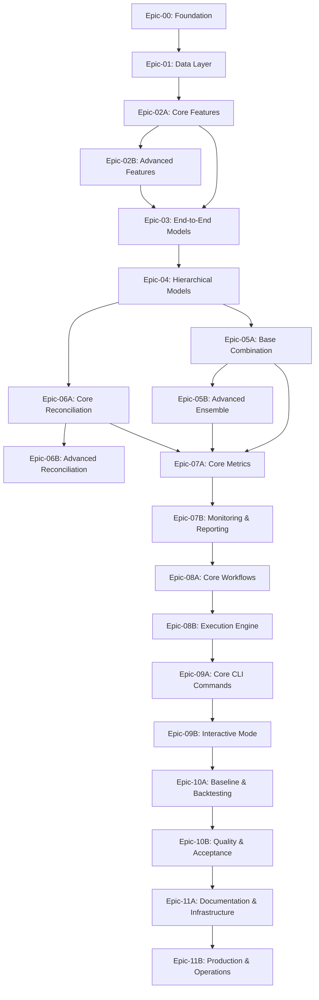

# 📋 Epic Index - Unified Electric Load Forecasting System

**Project:** PrevCarga Unified System  
**Version:** 1.0.0  
**Last Updated:** November 17, 2025

---

## 🎯 Project Overview

Migration from PrevCargaDESSEM (R) to a unified Python platform for short-term electric load forecasting (D+0 to D+8), integrating multiple models with hierarchical and end-to-end architectures.

**Key Metrics:**
- 26 time series (17 areas + 4 subsystems + 4 losses + 1 national)
- 5 base models (LGBM, Random Forest, RegDin+SVM, Holt-Winters)
- 33-week timeline (~7.5 months)
- 7 major milestones

---

## 📊 Epic Structure

### **Epic Breakdown by Development Phase**

| Epic ID | Epic Name | Phase | Duration | Dependencies | Priority |
|---------|-----------|-------|----------|--------------|----------|
| [Epic-00](Epic-00.md) | Project Foundation & Setup | Phase 0 | 1 week | None | Critical |
| [Epic-01](Epic-01.md) | Data Infrastructure Layer | Phase 1 | 2 weeks | Epic-00 | Critical |
| [Epic-02A](Epic-02A.md) | Core Feature Engineering | Phase 2A | 2 weeks | Epic-01 | Critical |
| [Epic-02B](Epic-02B.md) | Advanced Feature Transformations | Phase 2B | 2 weeks | Epic-02A | High |
| [Epic-03](Epic-03.md) | Model Layer - End-to-End Models | Phase 3 | 4 weeks | Epic-02A | High |
| [Epic-04](Epic-04.md) | Model Layer - Hierarchical Models | Phase 4 | 3 weeks | Epic-03 | High |
| [Epic-05A](Epic-05A.md) | Base Combination Strategies | Phase 5A | 2 weeks | Epic-04 | High |
| [Epic-05B](Epic-05B.md) | Advanced Ensemble Methods | Phase 5B | 2 weeks | Epic-05A | High |
| [Epic-06A](Epic-06A.md) | Core Hierarchical Reconciliation | Phase 6A | 1 week | Epic-04 | High |
| [Epic-06B](Epic-06B.md) | Advanced Reconciliation Methods | Phase 6B | 1 week | Epic-06A | High |
| [Epic-07A](Epic-07A.md) | Core Metrics & Analysis | Phase 7A | 1 week | Epic-05A, Epic-06A | Medium |
| [Epic-07B](Epic-07B.md) | Monitoring & Reporting | Phase 7B | 1 week | Epic-07A | Medium |
| [Epic-08A](Epic-08A.md) | Core Workflows & Configuration | Phase 8A | 2 weeks | Epic-07B | High |
| [Epic-08B](Epic-08B.md) | Execution Engine & Monitoring | Phase 8B | 1 week | Epic-08A | High |
| [Epic-09A](Epic-09A.md) | Core CLI Commands | Phase 9A | 1 week | Epic-08B | High |
| [Epic-09B](Epic-09B.md) | Interactive Mode & Advanced Features | Phase 9B | 1 week | Epic-09A | High |
| [Epic-10A](Epic-10A.md) | Baseline Validation & Comprehensive Backtesting | Phase 10A | 2 weeks | Epic-09B | Critical |
| [Epic-10B](Epic-10B.md) | Quality Assurance & Acceptance Validation | Phase 10B | 1 week | Epic-10A | Critical |
| [Epic-11A](Epic-11A.md) | Documentation & Infrastructure | Phase 11A | 1 week | Epic-10B | Critical |
| [Epic-11B](Epic-11B.md) | Production Deployment & Operations | Phase 11B | 1 week | Epic-11A | Critical |

---

## 🗓️ Timeline Overview

```
Week 0  ━━━━━━━━━━━━━━━━━━━━━━━━━━━━━━━━━━━━━━━━━━━━ Week 33
│       │           │           │           │           │
M0      M1          M2          M4          M5      M6  M7
Setup   Data+       LGBM        Complete    CLI     Val Prod
        Features    Model       System
```

### Milestone Mapping

| Milestone | Week | Epics Completed | Key Deliverable |
|-----------|------|-----------------|-----------------|
| **M0: Kickoff** | 0 | - | Project initialized |
| **M1: MVP Data + Features** | 6 | Epic-00, 01, 02A | Data pipeline + common features working |
| **M2: First Model (LGBM)** | 11 | Epic-03 (partial) | LGBM training and predicting |
| **M3: All Models** | 18 | Epic-03, 04 | 5 models working independently |
| **M4: Combination & Reconciliation** | 23 | Epic-05A, 05B, 06A, 06B, 07 | Complete system (no CLI) |
| **M5: Functional CLI** | 26 | Epic-08, 09A, 09B | CLI with all commands |
| **M6: Complete Validation** | 29 | Epic-10A, 10B | Results validated vs baseline |
| **M7: Production** | 33 | Epic-11A, 11B | Fargate deploy + documentation |

---

## 📈 Epic Details Summary

### **Epic-00: Project Foundation & Setup** (Week 1)
**Goal:** Establish project infrastructure and development environment

**Key Components:**
- Repository structure
- Python environment (uv - fast Python package installer)
- S3 configuration (boto3)
- Logging framework
- Local test scripts (pytest, ruff, black)

**Success Criteria:**
✅ Repository organized with proper structure  
✅ Dependencies managed via uv (pyproject.toml)  
✅ S3 bucket created and accessible  
✅ Structured logging working  
✅ Local test/lint/format scripts executable

---

### **Epic-01: Data Infrastructure Layer** (Weeks 2-3)
**Goal:** Build robust data loading and preprocessing system

**Key Components:**
- S3 Parquet loaders
- Pydantic schemas for validation
- Missing value imputation
- Hourly → semi-hourly resampling
- Data catalog system

**Success Criteria:**
✅ Load raw data from S3 (load, temperature, holidays)  
✅ Schema validation working  
✅ Missing values handled correctly  
✅ Data catalog tracks all datasets  
✅ 80%+ unit test coverage

---

### **Epic-02A: Core Feature Engineering** (Weeks 4-5)
**Goal:** Implement plugin architecture and essential feature transformations

**Key Components:**
- Plugin architecture (BaseFeaturePlugin)
- Common features (temporal, calendar, lags)
- Dummy encoding and cyclical features
- Holiday and special day features
- Feature pipeline composer
- Basic validation framework

**Success Criteria:**
✅ Plugin system extensible and documented  
✅ 4+ core feature plugins implemented  
✅ Pipeline composer combines plugins  
✅ Feature validation working  
✅ LGBM can use generated features

---

### **Epic-02B: Advanced Feature Transformations** (Weeks 6-7)
**Goal:** Implement advanced signal processing and model-specific features

**Key Components:**
- LOESS smoothing plugin
- Wavelet transform plugin (DWT)
- BLF strategy plugin (intraday)
- Seasonality calculation plugin
- RF horizon-aware feature selector
- Feature importance tracking
- Performance optimization

**Success Criteria:**
✅ Advanced transformation plugins working  
✅ Wavelet features generated correctly  
✅ BLF strategy enables intraday updates  
✅ RF feature selection prevents data leakage  
✅ Performance benchmarks met (<2min per area)

---

### **Epic-03: Model Layer - End-to-End Models** (Weeks 7-10)
**Goal:** Implement LGBM and Random Forest models with full training pipeline

**Key Components:**
- Base model interface
- Model registry system
- Semantic versioning
- LGBM with custom objective
- LGBM BLF predictor (intraday)
- Random Forest (216 models)
- Serialization/deserialization
- Universal trainer

**Success Criteria:**
✅ LGBM trains and predicts (D+0, D+1)  
✅ RF trains and predicts (D+0 to D+8)  
✅ Intraday BLF strategy works  
✅ Models save/load with versioning  
✅ Training parallelization functional

---

### **Epic-04: Model Layer - Hierarchical Models** (Weeks 11-13)
**Goal:** Implement hierarchical forecasting models (RegDin+SVM, Holt-Winters)

**Key Components:**
- ARIMA demand mean (statsforecast)
- SVM profile models (48 models)
- DM→Profile pipeline
- Holt-Winters demand mean
- Holt-Winters profile models
- Hierarchical pipeline orchestration

**Success Criteria:**
✅ RegDin+SVM pipeline working  
✅ Holt-Winters pipeline working  
✅ Both models forecast D+0 to D+8  
✅ Hierarchical structure respected  
✅ Integration tests pass

---

### **Epic-05A: Base Combination Strategies** (Weeks 14-15)
**Goal:** Implement foundational model combination approaches with fixed and learned weights

**Key Components:**
- Base combiner interface
- Weighted voting (fixed/learned weights)
- Simple averaging combiner
- Best model selector
- Basic bias correction
- Weight validation framework

**Success Criteria:**
✅ Base combiner interface extensible and documented  
✅ 3+ basic combination strategies implemented  
✅ Weight optimization for fixed strategies converges  
✅ Basic bias correction improves accuracy  
✅ LGBM + RF combination outperforms individuals

---

### **Epic-05B: Advanced Ensemble Methods** (Weeks 16-17)
**Goal:** Implement sophisticated ensemble methods with dynamic weighting and meta-learning

**Key Components:**
- Stacking combiner with meta-model
- Markov Chain combiner (dynamic weights)
- Context-aware weight adaptation
- Advanced bias correction module
- Ensemble diversity metrics
- Performance-based model selection

**Success Criteria:**
✅ Stacking meta-model improves over base combinations  
✅ Markov Chain uses context for dynamic weighting  
✅ Advanced bias correction reduces systematic errors  
✅ Ensemble diversity metrics guide model selection  
✅ Combined predictions consistently outperform individuals

---

### **Epic-06A: Core Hierarchical Reconciliation** (Week 17)
**Goal:** Implement fundamental hierarchical reconciliation with MinT method

**Key Components:**
- Hierarchy definition system (YAML → Graph)
- Base reconciliation interface
- MinT reconciler implementation (default method)
- Hierarchy validation framework
- Basic aggregation constraints
- Loss calculation by difference

**Success Criteria:**
✅ Hierarchy correctly defined and validated (4 subsystems, 17 areas)  
✅ MinT reconciliation working with proper matrix operations  
✅ Subsystem = Σ(Areas) constraint enforced  
✅ National = Σ(Subsystems) constraint enforced  
✅ Loss calculations accurate and efficient  
✅ Reconciliation interface extensible for additional methods

---

### **Epic-06B: Advanced Reconciliation Methods** (Week 18)
**Goal:** Implement advanced reconciliation methods with weighted approaches

**Key Components:**
- OLS reconciler with covariance estimation
- WLS reconciler (variance/error-based weights)
- Shrinkage reconciler for improved robustness
- Performance-based reconciler selection
- Reconciliation quality metrics
- Method comparison framework

**Success Criteria:**
✅ OLS reconciler improves over MinT in specific scenarios  
✅ WLS reconciler uses forecast variance for optimal weighting  
✅ Shrinkage method provides robust reconciliation  
✅ Automatic method selection based on performance metrics  
✅ Reconciliation quality metrics guide method choice  
✅ All methods maintain hierarchical consistency

---

### **Epic-07A: Core Metrics & Analysis** (Week 19)
**Goal:** Implement foundational metrics calculation and statistical analysis

**Key Components:**
- Metrics calculation (MAPE, MAE, RMSE)
- Percentile analysis (P5-P95)
- Metrics by time period (peak/off-peak)
- Metrics by horizon (D+0 to D+8)
- Statistical tests and significance analysis

**Success Criteria:**
✅ All metrics calculated correctly with edge case handling  
✅ Breakdown by period and horizon providing actionable insights  
✅ Percentile analysis and distribution fitting working  
✅ Statistical significance testing operational  
✅ Performance benchmarks met (<5s for full evaluation)

---

### **Epic-07B: Monitoring & Reporting** (Week 20)
**Goal:** Advanced monitoring with drift detection and comprehensive reporting

**Key Components:**
- Drift detector (CUSUM, KS tests, Page-Hinkley)
- Model comparator with statistical testing
- HTML/CSV/PDF report generator
- Alert system with configurable thresholds
- Automated scheduling and distribution

**Success Criteria:**
✅ Drift detection flags degradation with >90% accuracy  
✅ Model comparison matrices generated with statistical tests  
✅ Multi-format reports generated in <30s  
✅ Alert system operational with severity levels  
✅ Reports are readable, actionable, and distributable

---

### **Epic-08A: Core Workflows & Configuration** (Weeks 21-22)
**Goal:** Implement core orchestration workflows and configuration management

**Key Components:**
- Config manager with YAML validation and Pydantic schemas
- Training workflow orchestrator with dependency management
- Prediction workflows (batch and intraday)
- Backtesting workflow with retraining evaluation
- Workflow state management and progress tracking

**Success Criteria:**
✅ Configuration system handles all parameters with validation  
✅ Training workflow orchestrates all 5 models across 26 series  
✅ Batch predictions complete in <15 minutes  
✅ Intraday predictions complete in <5 minutes  
✅ Backtesting framework evaluates retraining intervals  
✅ Workflow progress tracking operational

---

### **Epic-08B: Execution Engine & Monitoring** (Week 23)
**Goal:** Advanced parallel execution and operational monitoring

**Key Components:**
- Parallel execution engine with resource optimization
- Dynamic concurrency and fault tolerance
- Structured logging with JSON format
- Performance metrics and correlation tracking
- Real-time alerting and monitoring integration

**Success Criteria:**
✅ Parallel execution reduces runtime by >60%  
✅ Resource utilization optimized (CPU 70-85%, Memory <80%)  
✅ Structured logs with correlation IDs operational  
✅ Performance metrics captured for all operations  
✅ Real-time alerting on critical events working  
✅ Fault tolerance handles failures gracefully

---

### **Epic-09A: Core CLI Commands** (Week 24)
**Goal:** Implement core command-line interface with essential commands

**Key Components:**
- Click application structure with global options
- Version and status commands
- Training commands (model, batch)
- Prediction commands (batch, intraday)
- Feature engineering commands (generate, evaluate, validate)
- Input validators and error handling
- Progress bars for long-running operations

**Success Criteria:**
✅ CLI application structure operational  
✅ Training commands support all 5 models  
✅ Prediction commands with combination/reconciliation  
✅ Feature commands integrated  
✅ Input validation prevents configuration errors  
✅ Progress bars show real-time status  
✅ Help texts clear and complete

---

### **Epic-09B: Interactive Mode & Advanced Features** (Week 25)
**Goal:** Provide interactive CLI mode and advanced command features

**Key Components:**
- Evaluation and backtesting commands
- Interactive CLI mode (prompt_toolkit)
- Guided workflows for common tasks
- Configuration management commands
- Command history and auto-completion
- Advanced help system with examples
- E2E command testing

**Success Criteria:**
✅ Evaluation commands (model, combination, backtest)  
✅ Interactive mode with guided workflows  
✅ Configuration management operational  
✅ Auto-completion for commands and parameters  
✅ Command history persistent  
✅ E2E tests cover main user workflows  
✅ User experience optimized (<2s startup)

---

### **Epic-10A: Baseline Validation & Comprehensive Backtesting** (Weeks 27-28)
**Goal:** Validate system accuracy against PrevCargaDESSEM baseline and execute comprehensive backtesting

**Key Components:**
- Baseline validation framework
- PrevCargaDESSEM baseline reproduction
- Statistical validation and comparison
- 1-year comprehensive backtest (2024)
- Walk-forward validation with weekly retraining
- Model performance analysis and comparison
- Statistical significance testing

**Success Criteria:**
✅ Baseline reproduction within ±5% MAPE of PrevCargaDESSEM  
✅ 1-year backtest completes in <8 hours  
✅ All 5 models validated across 26 time series  
✅ Model combinations outperform individuals  
✅ Reconciliation maintains hierarchical consistency  
✅ Statistical tests validate performance differences

---

### **Epic-10B: Quality Assurance & Acceptance Validation** (Week 29)
**Goal:** Ensure code quality, system robustness, and production readiness

**Key Components:**
- System performance validation and benchmarking
- Load testing and scalability validation
- Code quality validation (coverage, metrics, security)
- Test coverage analysis (>70% target)
- Security vulnerability scanning
- Final acceptance criteria validation
- Production readiness checklist
- Stakeholder approval and sign-off

**Success Criteria:**
✅ Test coverage >70% across all components  
✅ Performance benchmarks met (training, prediction, latency)  
✅ System robustness validated under failure scenarios  
✅ Zero high-severity security vulnerabilities  
✅ All epic acceptance criteria >95% satisfied  
✅ Production readiness checklist 100% complete  
✅ Stakeholder approval obtained

---

### **Epic-11A: Documentation & Infrastructure** (Week 30)
**Goal:** Create comprehensive documentation and production-ready Docker infrastructure

**Key Components:**
- Comprehensive documentation suite (README, installation, usage, API reference)
- Sphinx-generated API documentation
- Extension and plugin development guides
- Multi-stage production Dockerfile
- Docker Compose for local development
- Container security scanning and optimization
- Infrastructure as Code (Terraform/CDK)
- AWS infrastructure setup (VPC, security groups, IAM)

**Success Criteria:**
✅ Complete documentation suite created and reviewed  
✅ API reference documentation generated  
✅ Production Dockerfile optimized (<2GB)  
✅ Container security scans passed  
✅ Infrastructure as Code validated  
✅ AWS infrastructure provisioned  
✅ All documentation accessible and tested

---

### **Epic-11B: Production Deployment & Operations** (Week 31)
**Goal:** Deploy to production and complete operations handoff

**Key Components:**
- AWS Fargate service deployment
- Application Load Balancer configuration
- Auto-scaling and health checks
- EventBridge scheduling (30-minute intervals)
- CloudWatch monitoring and dashboards
- Alert configuration and SNS notifications
- Operational runbooks and procedures
- Operations team training and handoff
- 24/7 support procedures

**Success Criteria:**
✅ Fargate service deployed and operational  
✅ Auto-scaling tested and functional  
✅ Scheduler triggers predictions every 30 minutes  
✅ Monitoring dashboards and alerts active  
✅ Operational runbooks complete  
✅ Operations team trained and certified  
✅ 24/7 support procedures established  
✅ Production handoff complete

---

## 🔗 Epic Dependencies



---

## 📊 Resource Allocation

### Team Composition (Recommended)
- **Tech Lead / Architect**: 1 FTE (full project)
- **ML Engineers**: 2 FTE (Epics 02-07)
- **Backend Engineers**: 2 FTE (Epics 01, 08-09)
- **DevOps Engineer**: 0.5 FTE (Epics 00, 11)
- **QA Engineer**: 1 FTE (Epic 10, ongoing)

### Critical Path
Epic-00 → Epic-01 → Epic-02A → Epic-03 → Epic-04 → Epic-05A → Epic-07A → Epic-07B → Epic-08A → Epic-08B → Epic-09A → Epic-09B → Epic-10A → Epic-10B → Epic-11A → Epic-11B

**Note:** Epic-02B (Advanced Features) can run in parallel with Epic-03 after Epic-02A completion, Epic-05B (Advanced Ensemble) can run in parallel with Epic-06A after Epic-05A completion, and Epic-06B can run in parallel with Epic-07A after Epic-06A completion, allowing for faster delivery of core modeling capabilities.

**Total Critical Path Duration:** 27 weeks (Epics 05-07 can run partially in parallel)

---

## 🎯 Success Metrics

### Technical Metrics
- **Accuracy**: MAPE within ±5% of baseline
- **Performance**: 
  - Training 1 area + 1 model: <30min
  - Intraday prediction: <5min
  - 1-year backtest: <8h
- **Quality**: Test coverage >70%
- **Reliability**: Drift detection accuracy >90%

### Operational Metrics
- **Availability**: 99.5% uptime for prediction service
- **Latency**: P95 prediction latency <3min
- **Scalability**: Support 26 time series without degradation
- **Maintainability**: New model plugin in <2 days

---

## 📚 Related Documents

- [MVP Plan](../mvp-plan.md) - Complete macro plan
- [Phase 0 + 1 Details](../phases/phase-0-1.md) - Detailed specification (TBD)
- [Architecture Decision Records](../adr/) - Technical decisions (TBD)
- [API Documentation](../../api/) - Generated API docs (TBD)

---

## 🔄 Change Log

| Date | Version | Changes | Author |
|------|---------|---------|--------|
| 2025-11-17 | 1.0.0 | Initial epic index created | System |

---

**Next Steps:**
1. Review and approve epic breakdown with stakeholders
2. Create detailed epic documents (Epic-00.md through Epic-11.md)
3. Break down each epic into user stories and tasks
4. Assign ownership and start Epic-00 (Foundation)

---

**Epic Status Dashboard:** [View Project Board](../../project-board.md) (TBD)
