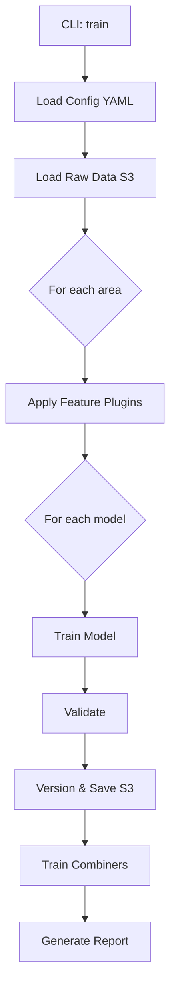
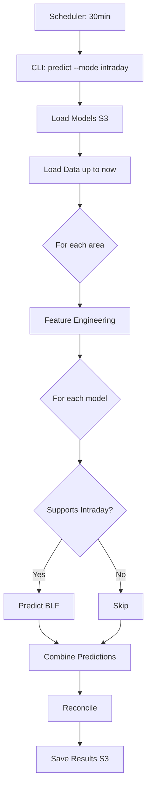
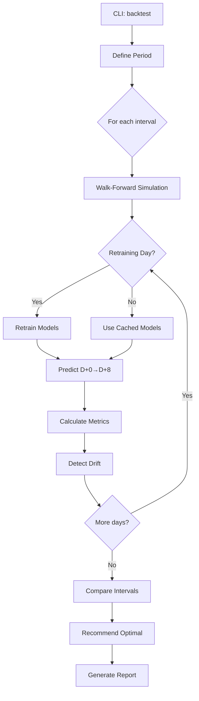

# 📊 MACRO PLAN - Unified Electric Load Forecasting System

**Version:** 1.0.0  
**Date:** 11/17/2025  
**Objective:** Modernize and unify short-term electric load forecasting systems (D+0 to D+8)

---

## 🎯 Overview

### Context
Migration from PrevCargaDESSEM system (R) to a unified Python platform that integrates multiple forecasting models with hierarchical architectures (DM→Profile) and end-to-end, supporting:
- 26 time series (17 areas + 4 subsystems + 4 losses + 1 national)
- 5 base models (LGBM, Random Forest, RegDin+SVM, Holt-Winters, future models)
- Bottom-up hierarchical reconciliation
- Advanced model combination (Stacking, Voting, Markov Chain)
- Operational intraday execution (every 30min) and daily batch

### Architectural Principles
✅ **Modularity**: Independent and pluggable components  
✅ **Extensibility**: Plugin system for models, features, combination and metrics  
✅ **Reproducibility**: Configurable seeds, semantic versioning  
✅ **Flexibility**: YAML configuration, support for multiple scenarios  
✅ **Performance**: Intelligent parallelization, optimized cache  
✅ **Observability**: Detailed logging, comparative metrics, drift detection  

---

## 🏗️ System Architecture

```
┌─────────────────────────────────────────────────────────────────┐
│                        CLI Python (Click)                        │
│  Commands: train | predict | backtest | combine | eval-*        │
│            --storage-backend [s3|local]                          │
└────────────────────┬────────────────────────────────────────────┘
                     │
        ┌────────────┴────────────┐
        │   Orchestrator Layer     │
        │  - Config Management     │
        │  - Workflow Execution    │
        │  - Parallel Coordination │
        └────────────┬────────────┘
                     │
     ┌───────────────┼───────────────┐
     │               │               │
┌────▼─────┐  ┌─────▼──────┐  ┌────▼─────┐
│  Data    │  │  Feature   │  │  Model   │
│  Layer   │  │  Layer     │  │  Layer   │
└────┬─────┘  └─────┬──────┘  └────┬─────┘
     │              │               │
┌────▼──────────────▼───────────────▼─────┐
│       Storage Backend (Abstract)         │
│  ┌──────────────┐    ┌────────────────┐ │
│  │ S3 Backend   │    │ Local Backend  │ │
│  │ (Production) │    │ (Development)  │ │
│  └──────────────┘    └────────────────┘ │
│  raw/ features/ models/ results/         │
└──────────────────────────────────────────┘
     │              │               │
┌────▼─────┐  ┌─────▼──────┐  ┌────▼─────┐
│Combiner  │  │Reconciler  │  │Evaluator │
│  Layer   │  │  Layer     │  │  Layer   │
└──────────┘  └────────────┘  └──────────┘
```

---

## 📁 Storage Structure

**Supports both S3 (production) and Local Filesystem (development)**

### S3 Structure
```yaml
s3://prevcarga-bucket-sandbox/
│
├── raw_data/                      # Raw data
│   ├── {year}/
│   │   ├── {month}/
│   │   │   ├── carga_horaria_{cod_area}_{YYYYMMDD}.parquet
│   │   │   ├── temperatura_prevista_{cod_area}_{YYYYMMDD}.parquet
│   │   │   └── feriados_{year}.parquet
│
├── features/                      # Calculated features (optional, on-demand)
│   ├── {version}/                # Ex: v1.0.0
│   │   ├── {model}/              # Ex: lgbm, rf, regdin_svm
│   │   │   ├── {cod_area}/
│   │   │   │   ├── train_{YYYYMMDD}.parquet
│   │   │   │   └── inference_{YYYYMMDD}.parquet
│
├── models/                        # Trained models
│   ├── {model}/                  # Ex: lgbm_dm, svm_perfil_00h30
│   │   ├── {version}/            # Ex: v1.2.3_20250117_143022
│   │   │   ├── metadata.yaml     # Config, metrics, training date
│   │   │   ├── model.pkl         # Serialized model
│   │   │   ├── scaler.pkl        # Auxiliary objects
│   │   │   └── feature_names.json
│   │   └── latest -> v1.2.3_...  # Symlink to most recent version
│
├── results/                       # Forecasts and evaluations
│   ├── predictions/
│   │   ├── {execution_date}/     # Ex: 20250117_080000
│   │   │   ├── individual/       # Predictions by model
│   │   │   │   ├── lgbm_{cod_area}_{horizon}.parquet
│   │   │   │   ├── rf_{cod_area}_{horizon}.parquet
│   │   │   ├── combined/         # Combined predictions
│   │   │   │   └── combined_{cod_area}_{horizon}.parquet
│   │   │   └── reconciled/       # Reconciled predictions
│   │   │       ├── areas_{horizon}.parquet
│   │   │       └── subsistemas_{horizon}.parquet
│   │
│   └── backtests/
│       ├── {backtest_id}/        # Ex: backtest_2024Q1_retrain7d
│       │   ├── config.yaml       # Backtest configuration
│       │   ├── metrics_summary.csv
│       │   ├── predictions_full.parquet
│       │   └── report.html       # Interactive report
│
└── cache/                         # Temporary cache (configurable TTL)
    └── {execution_id}/
        ├── intermediate_features/
        └── temp_predictions/
```

### Local Filesystem Structure
```yaml
./data/                            # Base path (configurable)
│
├── raw_data/                      # Raw data
│   ├── {year}/
│   │   ├── {month}/
│   │   │   ├── carga_horaria_{cod_area}_{YYYYMMDD}.parquet
│   │   │   ├── temperatura_prevista_{cod_area}_{YYYYMMDD}.parquet
│   │   │   └── feriados_{year}.parquet
│
├── features/                      # Calculated features
│   ├── {version}/
│   │   ├── {model}/
│   │   │   ├── {cod_area}/
│   │   │   │   ├── train_{YYYYMMDD}.parquet
│   │   │   │   └── inference_{YYYYMMDD}.parquet
│
├── models/                        # Trained models
│   ├── {model}/
│   │   ├── {version}/
│   │   │   ├── metadata.yaml
│   │   │   ├── model.pkl
│   │   │   ├── scaler.pkl
│   │   │   └── feature_names.json
│   │   └── latest -> v1.2.3_...  # Symlink
│
├── results/                       # Forecasts and evaluations
│   ├── predictions/
│   │   ├── {execution_date}/
│   │   │   ├── individual/
│   │   │   ├── combined/
│   │   │   └── reconciled/
│   └── backtests/
│       ├── {backtest_id}/
│       │   ├── config.yaml
│       │   ├── metrics_summary.csv
│       │   ├── predictions_full.parquet
│       │   └── report.html
│
└── cache/                         # Temporary cache
    └── {execution_id}/
        ├── intermediate_features/
        └── temp_predictions/
```

**Note:** Both structures use identical relative paths, enabling transparent switching between backends.

---

## 🧩 Main Components

### 1. Data Layer (`src/data/`)

**Responsibilities:**
- Load raw data from any storage backend (load, temperature, holidays)
- Schema validation (Pydantic)
- Missing values imputation
- Filtering by area/period
- Hourly → semi-hourly conversion
- Backend-agnostic data operations

**Modules:**
```python
data/
├── loaders.py          # DataLoader (unified, uses StorageBackend)
├── validators.py       # CargaSchema, TemperaturaSchema
├── preprocessors.py    # ImputerChain, ResamplerMixin
└── catalog.py          # DataCatalog (dataset registry)
```

**Storage Backend Integration:**
```python
from src.storage.factory import StorageFactory
from src.data.loaders import DataLoader

# Auto-detect or explicit backend
backend = StorageFactory.from_config()  # Uses config.yaml
# or
backend = StorageFactory.create("local", base_path="./data")
# or
backend = StorageFactory.create("s3", bucket="prevcarga-bucket")

# DataLoader works with any backend
loader = DataLoader(storage_backend=backend)
df = loader.load_carga(["RJ", "SP"], start_date, end_date)
```

---

### 2. Feature Engineering Layer (`src/features/`)

**Responsibilities:**
- Common feature engineering (lags, dummies, cyclical)
- Model-specific feature engineering (plugins)
- Feature selection/evaluation
- Modular and composable pipeline

**Plugin Architecture:**
```python
@register_feature_plugin(name="wavelet_transform")
class WaveletFeaturePlugin(BaseFeaturePlugin):
    def transform(self, df: pd.DataFrame) -> pd.DataFrame:
        # Apply Haar wavelet on load/temp columns
        return df_with_wavelet_features
    
    def get_feature_names(self) -> List[str]:
        return [f"CarWav_{i}" for i in range(1, 33)]
```

**Planned Plugins:**
- `common_features`: Lags, calendar dummies, cyclical
- `wavelet_transform`: Haar wavelets (LGBM)
- `loess_smoothing`: LOESS smoothing (LGBM)
- `blf_strategy`: Intraday BLF strategy (LGBM)
- `rf_feature_selector`: Dynamic selection by lead_hour (RF)
- `hierarchical_features`: Features for DM→Profile models

**Modules:**
```python
features/
├── base.py               # BaseFeaturePlugin (ABC)
├── registry.py           # PluginRegistry
├── common.py             # LagFeatures, DummyFeatures, CyclicFeatures
├── plugins/
│   ├── wavelet.py
│   ├── loess.py
│   ├── blf.py
│   └── rf_selector.py
├── pipeline.py           # FeaturePipeline (compose plugins)
└── evaluation.py         # FeatureImportance, CorrelationAnalysis
```

---

### 3. Model Layer (`src/models/`)

**Responsibilities:**
- Implementation of 5 base models
- Plugin system for new models
- Training, prediction, serialization
- Semantic versioning

**Model Architecture:**

#### **3.1 LGBM (End-to-End)**
```python
models/lgbm/
├── model.py              # LGBMModel(BaseModel)
├── objective.py          # AsymmetricObjective (penalizes peak)
├── trainer.py            # LGBMTrainer
└── predictor.py          # LGBMPredictor (supports intraday BLF)
```

#### **3.2 Random Forest (End-to-End)**
```python
models/random_forest/
├── model.py              # RandomForestModel(BaseModel)
├── multi_model.py        # MultiModelRF (manages 216 models)
└── trainer.py            # RFTrainer (Joblib parallelization)
```

#### **3.3 Dynamic Regression + SVM (Hierarchical)**
```python
models/hierarchical/
├── demand_mean/
│   ├── arima.py          # ARIMADemandModel (statsforecast)
│   └── trainer.py        # ARIMATrainer
├── profile/
│   ├── svm.py            # SVMProfileModel (48 models)
│   └── trainer.py        # SVMTrainer (parallelization)
└── pipeline.py           # HierarchicalPipeline (DM→Profile)
```

#### **3.4 Holt-Winters (Hierarchical)**
```python
models/holtwinters/
├── demand_mean/
│   └── hw.py             # HoltWintersDemandModel
├── profile/
│   └── hw.py             # HoltWintersProfileModel (48 models)
└── pipeline.py           # HWHierarchicalPipeline
```

**Registry System:**
```python
@register_model(name="lgbm", type="end_to_end", horizon="D0-D1")
class LGBMModel(BaseModel):
    def train(self, X, y, **kwargs) -> ModelArtifact:
        ...
    
    def predict(self, X, **kwargs) -> np.ndarray:
        ...
    
    def save(self, path: str, version: str) -> None:
        ...
```

**Modules:**
```python
models/
├── base.py               # BaseModel (ABC), ModelArtifact
├── registry.py           # ModelRegistry
├── versioning.py         # SemanticVersion, ModelVersioner
├── lgbm/
├── random_forest/
├── hierarchical/
├── holtwinters/
└── trainer.py            # UniversalTrainer (coordinates training)
```

---

### 4. Combination Layer (`src/combination/`)

**Responsibilities:**
- Combination of predictions from multiple models
- Pluggable strategies (Voting, Stacking, Markov)
- Bias correction (intercept)
- Weight optimization by context

**Implemented Strategies:**

#### **4.1 Voting (Weighted Average)**
```python
WeightedVoting:
  - weights: Fixed or learned (linear regression)
  - variants: simple, weighted, inverse_error
```

#### **4.2 Stacking (Meta-Model)**
```python
StackingCombiner:
  - level_1: [lgbm, rf, regdin, hw]
  - meta_model: LGBM or LinearRegression
  - features: [pred_lgbm, pred_rf, ..., context]
```

#### **4.3 Markov Chain**
```python
MarkovCombiner:
  - state_space: (interval_30min, day_of_week, hour, holiday)
  - transition: P(Model_i better | context, hist_30d)
  - prediction: Dynamic weights per interval
```

#### **4.4 Bias Correction**
```python
BiasCorrector:
  - model: error = f(hour, day_of_week, temperature, model_used)
  - adjust: pred_final = pred_combined + correction
```

**Plugin System:**
```python
@register_combiner(name="markov_chain")
class MarkovChainCombiner(BaseCombiner):
    def fit(self, predictions: Dict[str, np.ndarray], 
            actual: np.ndarray, context: pd.DataFrame):
        # Train transition matrix
        ...
    
    def combine(self, predictions: Dict[str, np.ndarray], 
                context: pd.DataFrame) -> np.ndarray:
        # Combine using dynamic weights
        ...
```

**Modules:**
```python
combination/
├── base.py               # BaseCombiner (ABC)
├── registry.py           # CombinerRegistry
├── voting.py             # WeightedVoting, MedianVoting
├── stacking.py           # StackingCombiner
├── markov.py             # MarkovChainCombiner
├── bias_correction.py    # BiasCorrector
└── optimizer.py          # WeightOptimizer (trains weights)
```

---

### 5. Reconciliation Layer (`src/reconciliation/`)

**Responsibilities:**
- Bottom-up hierarchical reconciliation
- Ensure Subsystem = Σ(Areas)
- Losses by difference (absorb discrepancies)
- Methods: MinT, OLS, WLS

**Hierarchy:**
```
National
├── SECO (Subsystem)
│   ├── RJ, SP, MG, ES, MT, MS, AC, RO, DF, GO (Areas)
│   └── PESE (Losses = SECO - Σ(areas))
├── S (Subsystem)
│   ├── PR, SC, RS (Areas)
│   └── PES (Losses = S - Σ(areas))
├── NE (Subsystem)
│   ├── ALPE, PBRN, BASE, CE, PI, BAOE (Areas)
│   └── PENE (Losses = NE - Σ(areas))
└── N (Subsystem)
    ├── AM, PA, MA, TO, RR, AP (Areas)
    └── PEN (Losses = N - Σ(areas))
```

**Algorithm:**
```python
1. Forecast areas independently (17 series)
2. Aggregate areas by subsystem: SECO_base = Σ(RJ, SP, ...)
3. Reconcile using MinT/OLS/WLS: SECO_rec, areas_rec
4. Calculate losses: PESE = SECO_rec - Σ(areas_rec)
5. National = Σ(subsystems_rec)
```

**Modules:**
```python
reconciliation/
├── base.py               # BaseReconciler (ABC)
├── mint.py               # MinTReconciler (default)
├── ols.py                # OLSReconciler
├── wls.py                # WLSReconciler (variance/error weights)
├── hierarchy.py          # HierarchyDefinition (YAML → Graph)
└── loss_calculation.py   # LossCalculator (losses by difference)
```

---

### 6. Evaluation Layer (`src/evaluation/`)

**Responsibilities:**
- Metric calculation (MAPE, MAE, RMSE, percentiles)
- Metrics by time period (peak/off-peak)
- Drift detection (temporal degradation)
- Report generation

**Implemented Metrics:**
```python
- MAPE (Mean Absolute Percentage Error)
- MAE (Mean Absolute Error)
- RMSE (Root Mean Squared Error)
- Deviation percentiles: P5, P25, P50, P75, P95
- Maximum/minimum absolute and relative deviation
- Metrics by period: peak_night, off_peak
- Metrics by horizon: D+0, D+1, ..., D+8
```

**Drift Detection:**
```python
DriftDetector:
  - window: 30 days
  - baseline: Metrics from first 30d of backtest
  - threshold: +20% MAPE or +15% MAE
  - action: Flag for retraining
```

**Modules:**
```python
evaluation/
├── metrics.py            # MAPE, MAE, RMSE, Percentiles
├── comparator.py         # ModelComparator (comparison matrix)
├── drift.py              # DriftDetector
└── reporter.py           # HTMLReporter, CSVReporter
```

---

### 7. Orchestrator Layer (`src/orchestrator/`)

**Responsibilities:**
- Workflow coordination (train, predict, backtest)
- Multi-area/multi-model parallelization
- Configuration management
- Logging and monitoring

**Workflows:**

#### **7.1 Train Workflow**
```python
1. Load historical data (3 years)
2. For each area:
   a. Apply feature engineering (model plugins)
   b. Train models (intra-model parallelization)
   c. Validate and calculate metrics
   d. Version and save to S3
3. Train combination meta-models
4. Generate training report
```

#### **7.2 Predict Workflow**
```python
1. Load latest models from S3
2. Load data up to D+0 (or intraday up to current hour)
3. For each area (parallelization):
   a. Apply feature engineering
   b. Predict with each model (specific horizon)
4. Combine predictions (per 30min interval)
5. Reconcile hierarchically
6. Save results to S3
```

#### **7.3 Backtest Workflow**
```python
1. Define period (start_date, end_date)
2. For each day in period:
   a. Simulate forecast D+0→D+8
   b. Compare with actual
   c. Calculate metrics
   d. Detect drift
3. For each retraining interval [1,3,7,10,15]:
   a. Simulate periodic retraining
   b. Compare performance
4. Generate comparative report
5. Recommend optimal interval
```

**Modules:**
```python
orchestrator/
├── workflows/
│   ├── train.py          # TrainWorkflow
│   ├── predict.py        # PredictWorkflow
│   └── backtest.py       # BacktestWorkflow
├── parallel.py           # ParallelExecutor (joblib/multiprocessing)
├── config.py             # ConfigManager (load/validate YAML)
└── logger.py             # StructuredLogger (JSON logs)
```

---

### 8. CLI Layer (`src/cli/`)

**Responsibilities:**
- Command-line interface (Click)
- Argument mode (pipelines) and interactive mode (dev)
- Input validation
- Progress bars and feedback

**Main Commands:**

```bash
# === TRAINING ===
prevcarga train \
  --config config.yaml \
  --storage-backend s3 \
  --areas SECO_RJ,SECO_SP \
  --models lgbm,rf \
  --start-date 2022-01-01 \
  --end-date 2024-12-31 \
  --version 1.2.0 \
  --parallel 8

# === TRAINING (Local Development) ===
prevcarga train \
  --config config_dev.yaml \
  --storage-backend local \
  --areas SECO_RJ \
  --models lgbm \
  --start-date 2024-01-01 \
  --end-date 2024-12-31 \
  --version 0.1.0-dev

# === PREDICTION ===
prevcarga predict \
  --config config.yaml \
  --storage-backend s3 \
  --date 2025-01-17 \
  --mode intraday \
  --areas all \
  --models all \
  --reconcile \
  --output results/20250117/

# === BACKTEST ===
prevcarga backtest \
  --config config.yaml \
  --start-date 2024-01-01 \
  --end-date 2024-12-31 \
  --retrain-intervals 1,3,7,10,15 \
  --walk-forward \
  --models all \
  --report report.html

# === FEATURE ENGINEERING ===
prevcarga gen-features \
  --config config.yaml \
  --model lgbm \
  --areas SECO_RJ \
  --start-date 2024-01-01 \
  --end-date 2024-12-31 \
  --save-s3

prevcarga eval-features \
  --config config.yaml \
  --model lgbm \
  --areas SECO_RJ \
  --methods shap,correlation,stability

# === EVALUATION ===
prevcarga eval-model \
  --model-path s3://bucket/models/lgbm/latest \
  --test-data s3://bucket/test/2024Q4.parquet \
  --metrics all \
  --by-patamar

prevcarga eval-combination \
  --predictions-path s3://bucket/results/20250117/ \
  --actual-data s3://bucket/raw/2025/01/17/ \
  --compare-strategies voting,stacking,markov

# === COMBINATION ===
prevcarga combine \
  --predictions-path s3://bucket/results/20250117/individual/ \
  --strategy markov \
  --output-path s3://bucket/results/20250117/combined/ \
  --train-weights

# === INTERACTIVE MODE ===
prevcarga interactive
> Choose command: [train/predict/backtest/eval]
> ...
```

**Modules:**
```python
cli/
├── main.py               # Main Click app
├── commands/
│   ├── train.py          # @cli.command('train')
│   ├── predict.py
│   ├── backtest.py
│   ├── features.py
│   ├── evaluate.py
│   └── combine.py
├── interactive.py        # InteractiveCLI (prompt_toolkit)
└── validators.py         # InputValidators
```

---

## 🔄 Main Workflows

### Workflow 1: Initial Training


### Workflow 2: Operational Intraday Prediction


### Workflow 3: Backtest with Retraining Evaluation


---

## ⚙️ Configuration (config.yaml)

```yaml
# === GENERAL ===
project:
  name: "PrevCargaUnificado"
  version: "1.0.0"
  seed: 42

# === STORAGE ===
storage:
  backend: s3  # Options: 's3' or 'local'
  
  # Common paths (relative, work for both backends)
  paths:
    raw_data: raw_data/
    features: features/
    models: models/
    results: results/
  
  # S3-specific configuration (used when backend='s3')
  s3:
    bucket: prevcarga-bucket
    region: us-east-1
    endpoint_url: null  # Optional (for LocalStack/MinIO)
    connect_timeout: 60
    read_timeout: 300
    max_retries: 3
  
  # Local filesystem configuration (used when backend='local')
  local:
    base_path: ./data  # Absolute or relative to project root
    create_dirs: true  # Auto-create directories if missing

# === REGIONAL HIERARCHY ===
regions:
  subsistemas:
    SECO: [RJ, SP, MG, ES, MT, MS, AC, RO, DF, GO, PESE]
    S: [PR, SC, RS, PES]
    NE: [ALPE, PBRN, BASE, CE, PI, BAOE, PENE]
    N: [AM, PA, MA, TO, RR, AP, PEN]
  
  areas:
    - RJ
    - SP
    # ... [17 areas]
  
  perdas:
    PESE: subsistema: SECO
    PES: subsistema: S
    PENE: subsistema: NE
    PEN: subsistema: N

# === TIME PERIODS ===
patamares:
  SECO:
    Jan: {ponta_inicio: "17:30", ponta_fim: "20:30"}
    Fev: {ponta_inicio: "17:30", ponta_fim: "20:30"}
    # ... other months
  S:
    # ... South configuration
  # ... NE, N

# === MODELS ===
models:
  lgbm:
    enabled: true
    type: end_to_end
    horizon: [0, 1]  # D+0, D+1
    feature_plugins:
      - common_features
      - wavelet_transform
      - loess_smoothing
      - blf_strategy
    hyperparameters:
      max_leaves: 16
      min_data_in_leaf: 50
      learning_rate: 0.1
      num_iterations: 5000
    intraday: true
    
  random_forest:
    enabled: true
    type: end_to_end
    horizon: [0, 1, 2, 3, 4, 5, 6, 7, 8]
    n_models: 216  # 9 dias × 24h
    feature_plugins:
      - common_features
      - rf_feature_selector
    hyperparameters:
      ntree: 100
      seed: 123
    parallel:
      n_jobs: -1
    
  regdin_svm:
    enabled: true
    type: hierarchical
    horizon: [0, 1, 2, 3, 4, 5, 6, 7, 8]
    demand_mean:
      model: arima
      library: statsforecast
    profile:
      model: svm
      n_models: 48  # Semi-horário
      kernel: radial
      hyperparameters:
        epsilon: [0.001, 0.01, 0.1]
        cost: [1, 10]
    feature_plugins:
      - common_features
      - hierarchical_features
  
  holtwinters:
    enabled: true
    type: hierarchical
    horizon: [0, 1, 2, 3, 4, 5, 6, 7, 8]
    demand_mean:
      model: exponential_smoothing
      seasonal_periods: 7
    profile:
      model: exponential_smoothing
      n_models: 48
      seasonal_periods: 48
    feature_plugins:
      - common_features

# === COMBINATION ===
combination:
  default_strategy: markov_chain
  
  strategies:
    voting:
      type: weighted
      weight_method: inverse_error
    
    stacking:
      meta_model: lgbm
      meta_features: [predictions, hora, dia_semana, temperatura]
    
    markov_chain:
      history_window: 30  # days
      state_features: [intervalo_30min, dia_semana, hora, feriado]
      transition_smoothing: 0.1
    
  bias_correction:
    enabled: true
    model: lgbm
    features: [hora, dia_semana, temperatura, modelo_usado]

# === RECONCILIATION ===
reconciliation:
  method: mint  # mint | ols | wls
  
  wls_weights:
    type: variance  # variance | inverse_error
    window: 90  # days to calculate variance
  
  loss_calculation:
    method: difference  # losses = subsystem - sum(areas)

# === TRAINING ===
training:
  historical_window: 1095  # 3 years in days
  validation_split: 0.15
  test_split: 0.15
  
  retrain_evaluation:
    intervals: [1, 3, 7, 10, 15]  # days
    method: walk_forward
  
  parallel:
    areas: true
    models: true
    n_jobs: 8

# === EVALUATION ===
evaluation:
  metrics:
    - mape
    - mae
    - rmse
    - percentiles: [5, 25, 50, 75, 95]
    - max_deviation_abs
    - max_deviation_rel
  
  by_patamar: true
  by_horizon: true
  
  drift_detection:
    enabled: true
    baseline_window: 30
    threshold_mape: 1.2  # +20%
    threshold_mae: 1.15  # +15%

# === LOGGING ===
logging:
  level: INFO
  format: json
  handlers:
    - console
    - file: logs/prevcarga.log
  
  s3_backup:
    enabled: true
    path: logs/
```

---

## 🚀 Development Phases

### **PHASE 0: Initial Setup** (1 week)
- [ ] Directory structure
- [ ] Setup uv (fast Python package installer)
- [ ] Unified storage configuration (StorageBackend abstraction)
- [ ] S3StorageBackend implementation (boto3)
- [ ] LocalStorageBackend implementation (pathlib)
- [ ] StorageFactory (auto-detection and creation)
- [ ] Structured logging
- [ ] Local test scripts (pytest runner, linting, formatting)

### **FASE 1: Data Layer** (2 semanas)
- [ ] DataLoader (unified, uses StorageBackend)
- [ ] Schemas Pydantic (backend-agnostic)
- [ ] Preprocessors (missing, resampling)
- [ ] Data catalog (uses StorageBackend for persistence)
- [ ] Tests for both S3 and local backends
- [ ] Documentação

### **FASE 2: Feature Engineering** (3 semanas)
- [ ] Sistema de plugins base
- [ ] Common features (lags, dummies, cíclicas)
- [ ] Plugin wavelet
- [ ] Plugin LOESS
- [ ] Plugin BLF
- [ ] Plugin RF selector
- [ ] Feature pipeline composer
- [ ] Testes + benchmarks

### **PHASE 3: Model Layer - Part 1** (4 weeks)
- [ ] Base model interface
- [ ] Model registry
- [ ] Semantic versioning
- [ ] LGBM implementation
  - [ ] Custom objective
  - [ ] BLF predictor
  - [ ] Trainer
- [ ] Random Forest implementation
  - [ ] Multi-model manager (216)
  - [ ] Parallelization
- [ ] Serialization/deserialization
- [ ] Tests + validation

### **PHASE 4: Model Layer - Part 2** (3 weeks)
- [ ] RegDin + SVM (hierarchical)
  - [ ] ARIMA demand (statsforecast)
  - [ ] SVM profile (48 models)
  - [ ] DM→Profile pipeline
- [ ] Holt-Winters (hierarchical)
  - [ ] ETS demand
  - [ ] ETS profile
  - [ ] DM→Profile pipeline
- [ ] Integration tests

### **PHASE 5: Combination Layer** (3 weeks)
- [ ] Base combiner interface
- [ ] Voting combiners
- [ ] Stacking combiner
- [ ] Markov chain combiner
  - [ ] Transition matrix
  - [ ] Dynamic weights
- [ ] Bias corrector
- [ ] Weight optimizer
- [ ] Tests + validation

### **PHASE 6: Reconciliation Layer** (2 weeks)
- [ ] Hierarchy definition (YAML)
- [ ] MinT reconciler
- [ ] OLS reconciler
- [ ] WLS reconciler (variance/error)
- [ ] Loss calculator
- [ ] Numerical tests

### **PHASE 7: Evaluation Layer** (2 weeks)
- [ ] Base metrics (MAPE, MAE, RMSE)
- [ ] Percentiles and deviations
- [ ] Metrics by period
- [ ] Drift detector
- [ ] Model comparator
- [ ] HTML reporter
- [ ] Tests + examples

### **PHASE 8: Orchestrator** (3 weeks)
- [ ] Config manager (YAML)
- [ ] Train workflow
- [ ] Predict workflow (batch + intraday)
- [ ] Backtest workflow
- [ ] Parallel executor
- [ ] Structured logger
- [ ] Integration tests

### **PHASE 9: CLI** (2 weeks)
- [ ] Click app structure
- [ ] Commands: train, predict, backtest
- [ ] Commands: gen-features, eval-features
- [ ] Commands: eval-model, eval-combination, combine
- [ ] Interactive mode
- [ ] Validators
- [ ] Complete help texts
- [ ] E2E tests

### **PHASE 10: Testing and Validation** (3 weeks)
- [ ] Reproduce PrevCargaDESSEM results (baseline)
- [ ] Complete 2024 backtest (1 year)
- [ ] LGBM vs PrevCarga comparison
- [ ] RF vs PrevCarga comparison
- [ ] Evaluate combination vs individual models
- [ ] Evaluate reconciliation
- [ ] Performance benchmarks
- [ ] Final adjustments

### **PHASE 11: Documentation and Deploy** (2 weeks)
- [ ] Complete README
- [ ] Installation guide
- [ ] Usage guide (examples)
- [ ] Extension guide (plugins)
- [ ] API reference (Sphinx)
- [ ] Production Dockerfile
- [ ] Fargate deploy
- [ ] Scheduler configuration

---

## 📊 Milestones and Deliverables

| Milestone | Estimated Date | Deliverable |
|-------|---------------|------------|
| M1: MVP Data + Features | Week 6 | Data pipeline + common features working |
| M2: First Model (LGBM) | Week 11 | LGBM training and predicting (without combination) |
| M3: All Models | Week 18 | 5 models working independently |
| M4: Combination and Reconciliation | Week 23 | Complete system (without CLI) |
| M5: Functional CLI | Week 25 | CLI with all commands |
| M6: Complete Validation | Week 28 | Results validated vs baseline |
| M7: Production | Week 30 | Fargate deploy + documentation |

**Total estimated: ~7 months (30 weeks)**

---

## 🔌 Plugin System - Specification

### Feature Engineering Plugin
```python
from abc import ABC, abstractmethod
from typing import List, Dict, Any
import pandas as pd

class BaseFeaturePlugin(ABC):
    """Interface for feature engineering plugins."""
    
    @abstractmethod
    def transform(self, df: pd.DataFrame, **kwargs) -> pd.DataFrame:
        """Apply transformation and return DataFrame with new features."""
        pass
    
    @abstractmethod
    def get_feature_names(self) -> List[str]:
        """Return list of generated feature names."""
        pass
    
    @abstractmethod
    def get_config(self) -> Dict[str, Any]:
        """Return plugin configuration."""
        pass
    
    def validate(self, df: pd.DataFrame) -> bool:
        """Validate if DataFrame has necessary columns."""
        return True

# Registration via decorator
def register_feature_plugin(name: str):
    def decorator(cls):
        FeaturePluginRegistry.register(name, cls)
        return cls
    return decorator
```

### Model Plugin
```python
from abc import ABC, abstractmethod
import numpy as np

class BaseModel(ABC):
    """Interface for forecasting models."""
    
    @abstractmethod
    def train(self, X: np.ndarray, y: np.ndarray, **kwargs) -> 'ModelArtifact':
        """Train the model and return artifact."""
        pass
    
    @abstractmethod
    def predict(self, X: np.ndarray, **kwargs) -> np.ndarray:
        """Perform prediction."""
        pass
    
    @abstractmethod
    def save(self, path: str, version: str) -> None:
        """Serialize model with versioning."""
        pass
    
    @abstractmethod
    def load(self, path: str) -> 'BaseModel':
        """Load serialized model."""
        pass

def register_model(name: str, type: str, horizon: List[int]):
    def decorator(cls):
        ModelRegistry.register(name, cls, type=type, horizon=horizon)
        return cls
    return decorator
```

### Combination Plugin
```python
from abc import ABC, abstractmethod
from typing import Dict
import numpy as np
import pandas as pd

class BaseCombiner(ABC):
    """Interface for combination strategies."""
    
    @abstractmethod
    def fit(self, predictions: Dict[str, np.ndarray], 
            actual: np.ndarray, context: pd.DataFrame, **kwargs) -> None:
        """Train combination weights/parameters."""
        pass
    
    @abstractmethod
    def combine(self, predictions: Dict[str, np.ndarray], 
                context: pd.DataFrame, **kwargs) -> np.ndarray:
        """Combine predictions from multiple models."""
        pass
    
    @abstractmethod
    def get_weights(self) -> Dict[str, float]:
        """Return current weights (if applicable)."""
        pass

def register_combiner(name: str):
    def decorator(cls):
        CombinerRegistry.register(name, cls)
        return cls
    return decorator
```

### Reconciliation Plugin
```python
from abc import ABC, abstractmethod
import numpy as np

class BaseReconciler(ABC):
    """Interface for reconciliation methods."""
    
    @abstractmethod
    def reconcile(self, forecasts: np.ndarray, 
                  hierarchy: 'HierarchyGraph', **kwargs) -> np.ndarray:
        """Reconcile forecasts respecting hierarchy."""
        pass
    
    @abstractmethod
    def compute_weights(self, residuals: np.ndarray, **kwargs) -> np.ndarray:
        """Calculate weight matrix (if applicable)."""
        pass

def register_reconciler(name: str):
    def decorator(cls):
        ReconcilerRegistry.register(name, cls)
        return cls
    return decorator
```

---

## 🧪 Testing Strategy

### Test Pyramid
```
         /\
        /E2E\         10% - End-to-End Tests (complete CLI)
       /------\
      /  INT   \      30% - Integration Tests (workflows)
     /----------\
    /   UNIT     \    60% - Unit Tests (functions, classes)
   /--------------\
```

### Minimum Coverage
- **Unit**: 80%
- **Integration**: 70%
- **E2E**: Critical cases (happy path + common errors)

### Tools
- `pytest` (framework)
- `pytest-cov` (coverage)
- `pytest-xdist` (parallelization)
- `hypothesis` (property-based testing)
- `moto` (mock S3)

---

## 📚 Documentation

### Structure
```
docs/
├── index.md                    # Homepage
├── getting-started/
│   ├── installation.md
│   ├── quickstart.md
│   └── configuration.md
├── user-guide/
│   ├── training.md
│   ├── prediction.md
│   ├── backtest.md
│   └── evaluation.md
├── developer-guide/
│   ├── architecture.md
│   ├── adding-models.md
│   ├── adding-features.md
│   └── adding-combiners.md
├── api-reference/
│   ├── models.md
│   ├── features.md
│   └── evaluation.md
└── examples/
    ├── basic-training.md
    ├── custom-model.md
    └── production-setup.md
```

### Tools
- MkDocs (generator)
- Material theme
- Docstrings (Google style)
- Mermaid (diagrams)

---

## 🐳 Containerization

### Dockerfile
```dockerfile
FROM python:3.11-slim

# System dependencies
RUN apt-get update && apt-get install -y \
    gcc g++ make \
    libgomp1 \
    curl \
    && rm -rf /var/lib/apt/lists/*

# Install uv
COPY --from=ghcr.io/astral-sh/uv:latest /uv /usr/local/bin/uv

# Set working directory
WORKDIR /app

# Copy dependency files
COPY pyproject.toml uv.lock ./

# Install dependencies
RUN uv sync --frozen --no-dev

# Code
COPY src/ /app/src/
COPY config/ /app/config/

# Entrypoint
ENTRYPOINT ["uv", "run", "python", "-m", "src.cli.main"]
```

### AWS Fargate Task
```yaml
task_definition:
  family: prevcarga-unified
  cpu: 4096
  memory: 16384
  container:
    image: prevcarga:latest
    environment:
      AWS_REGION: us-east-1
      S3_BUCKET: prevcarga-bucket
      LOG_LEVEL: INFO
    command: ["predict", "--mode", "intraday", "--config", "/app/config/prod.yaml"]
```

---

## 🔐 Security and Compliance

### Best Practices
- [ ] Secrets via AWS Secrets Manager (never hardcoded)
- [ ] IAM roles with least privilege
- [ ] Encryption in transit (TLS) and at rest (S3 encryption)
- [ ] Audit logs (CloudTrail)
- [ ] Data versioning (S3 versioning)
- [ ] Automatic backup (S3 lifecycle)

### Reproducibility
- [ ] Fixed seeds in all random components
- [ ] Model versioning (semantic + timestamp)
- [ ] Configuration registry used (metadata.yaml)
- [ ] Dependency freeze (uv.lock)
- [ ] Tagged Docker images

---

## 📈 Monitoring (Future)

**Note**: Not implemented in first version, but architecture prepared for:
- Metrics in CloudWatch
- Alerts (SNS) for drift detection
- Grafana dashboard
- Experiment tracking (MLflow)

---

## ✅ Final Acceptance Checklist

### Core Functionalities
- [ ] Training of 5 models (LGBM, RF, RegDin+SVM, HW)
- [ ] Batch prediction (D+0 to D+8)
- [ ] Intraday prediction (30min)
- [ ] Combination (Voting, Stacking, Markov)
- [ ] Reconciliation (MinT, OLS, WLS)
- [ ] Backtest with retraining evaluation
- [ ] Pluggable feature engineering
- [ ] Complete CLI (10+ commands)

### Performance
- [ ] Training 1 area + 1 model: <30min
- [ ] Intraday prediction: <5min
- [ ] 1-year backtest: <8h
- [ ] Parallelization working

### Quality
- [ ] Test coverage >70%
- [ ] Complete documentation
- [ ] Reproduces baseline results ±5% MAPE
- [ ] Drift detection working
- [ ] Structured logs

### Deploy
- [ ] Functional Dockerfile
- [ ] Fargate deploy tested
- [ ] Production configurations validated
- [ ] Scheduler operational

---

## 🎓 Next Steps After M7

1. **Performance Optimizations**
   - GPU for LGBM/RF
   - Dask parallelization for large volumes
   - Redis cache for features

2. **New Models**
   - Transformers (temporal attention)
   - N-BEATS
   - Prophet

3. **Advanced Features**
   - Solar/wind generation data
   - Additional meteorological variables
   - Custom special events

4. **Combination Improvements**
   - AutoML for meta-model
   - Advanced ensemble learning
   - Hierarchical combination (different per level)

5. **Operationalization**
   - REST API (FastAPI)
   - Real-time dashboard
   - Alert system
   - Automatic retraining

---

**END OF MACRO PLAN**

**Next step**: Detailed specification of **PHASE 0 + PHASE 1** (Data Layer) with:
- Detailed directory structure
- Specific classes and interfaces
- Code examples
- Test cases