<!-- Título -->

<!-- _backgroundImage: "url('assets/SlideBackgorund.jpg')" -->
<!-- _color: white -->

# **PrevCarga Unificado**

## Sistema de Previsão de Carga Elétrica - Resultados e Validação

**Dezembro de 2025**

---

<!-- Agenda -->

## Agenda

1. **O Projeto PrevCarga Unificado**
2. **Resultados: Random Forest vs PrevCarga**
3. **Resultados: LGBM** (incluindo estabilidade)
4. **Análise por Subsistema**
5. **Arquitetura: Plugins e Storage Híbrido**
6. **Combinação de Modelos e Reconciliação**
7. **Auto-Avaliação e Retraining**
8. **Pipelines: RF e LGBM**
9. **Conclusões e Próximos Passos**
10. **Aceleração com IA: Claude Code**

---

## O Projeto: Escopo Entregue

* **Sistema unificado** de previsão de carga em Python
* **26 séries temporais** cobertas:
  - 17 áreas de carga
  - 4 subsistemas (SECO, S, NE, N)
  - 4 perdas + 1 nacional (SIN)
* **Horizonte**: D+0 até D+8 (semi-horário)
* **Modelos implementados**: LGBM, Random Forest, PrevCarga
* **Status**: Validação completa, ajustes finais em andamento

---

## Modelos Implementados e Validados

| Modelo | Status | Período Validado | Subsistemas |
|--------|--------|------------------|-------------|
| Random Forest | **Concluído** | Set/24 - Ago/25 | SECO, SUL |
| LGBM | **Concluído** | Jan - Out/25 | SECO, SUL |
| PrevCarga | **Referência** | 2024-2025 | Todos |

---

## Métricas de Validação

* **MAPE** (Mean Absolute Percentage Error) - métrica principal
* **MAE** (Mean Absolute Error) - erro absoluto
* **RMSE** (Root Mean Square Error) - penaliza outliers
* **R²** (Coeficiente de Determinação) - qualidade do ajuste

**Análises realizadas:**
* Por **horizonte** (D+1 a D+7)
* Por **mês** de teste
* Por **subsistema**

---

## Período de Validação

* **Random Forest vs PrevCarga**: Set/2024 a Ago/2025 (12 meses)
* **LGBM**: Janeiro a Outubro/2025 (10 meses)
* **Subsistemas testados**: SECO, SUL, N, NE
* **Total de observações**: ~365 dias × 48 intervalos × 4 subsistemas

---

## Resumo Executivo: RF vs PrevCarga (SECO)

* **Random Forest** superior em **6 de 12 meses**
* **PrevCarga** superior em **6 de 12 meses**
* MAPE médio RF: **3.24%** | PrevCarga: **3.12%**
* Ambos modelos **dentro da meta operacional (<5%)**
* RF mais estável, PrevCarga melhor em meses específicos

---

## MAPE Mensal: RF vs PrevCarga (SECO)

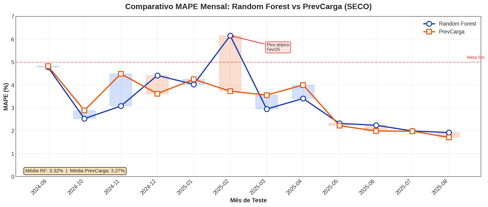

---

## R² Comparativo: RF vs PrevCarga (SECO)

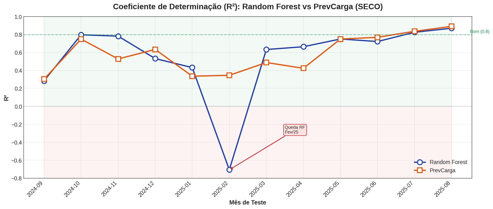

---

## Análise por Horizonte de Previsão

* Erro **aumenta com o horizonte** (comportamento esperado)
* D+1: MAPE ~2.5% | D+7: MAPE ~5.5%
* RF mais robusto em horizontes longos (D+5 a D+7)
* PrevCarga melhor em curto prazo (D+1 a D+3)

---

## MAPE por Horizonte - SECO

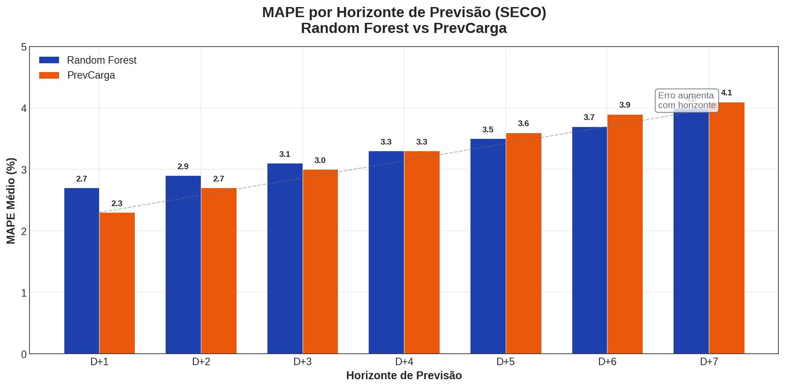

---

## MAPE por Horizonte - SUL

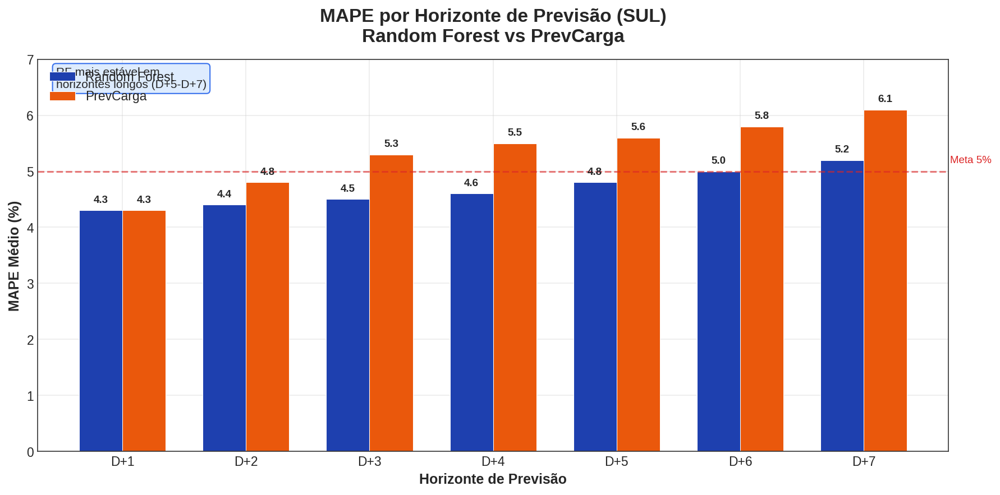

---

## Heatmap: MAPE por Mês × Horizonte (SECO)

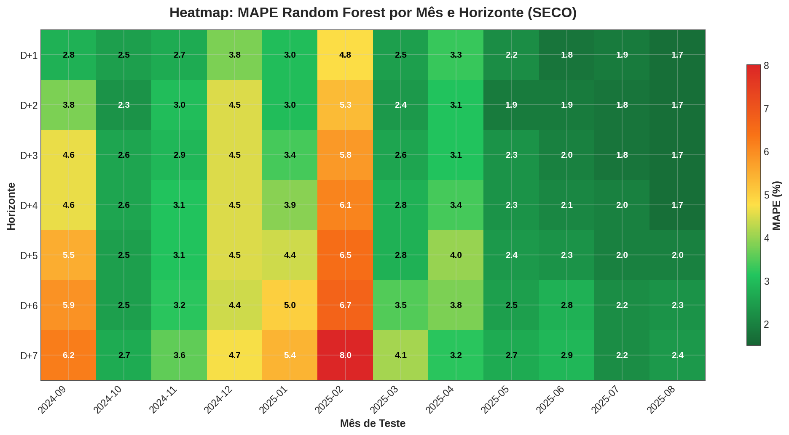

---

## Destaques: RF vs PrevCarga

| Aspecto | Random Forest | PrevCarga |
|---------|---------------|-----------|
| Melhor mês | Out/24 (2.53%) | Ago/25 (1.71%) |
| Pior mês | Fev/25 (6.16%) | Set/24 (4.83%) |
| Horizonte curto (D+1-3) | Bom | **Melhor** |
| Horizonte longo (D+5-7) | **Melhor** | Bom |
| Estabilidade | **Alta** | Variável |

---

## Conclusão: RF vs PrevCarga

* **Modelos complementares** - combinação é promissora
* RF oferece **maior estabilidade** temporal
* PrevCarga tem **picos de excelência** em meses específicos
* **Recomendação**: Usar combinação ponderada ou Markov

---

## LGBM: Visão Geral dos Resultados

* **Período**: Janeiro a Outubro/2025
* **Subsistemas**: SECO e SUL (S)
* **Variantes testadas**:
  - LGBM (padrão)
  - LGBM_BU_verif (bottom-up verificado)
  - LGBM_BU_naive (bottom-up naive)

---

## LGBM SECO - MAPE Mensal

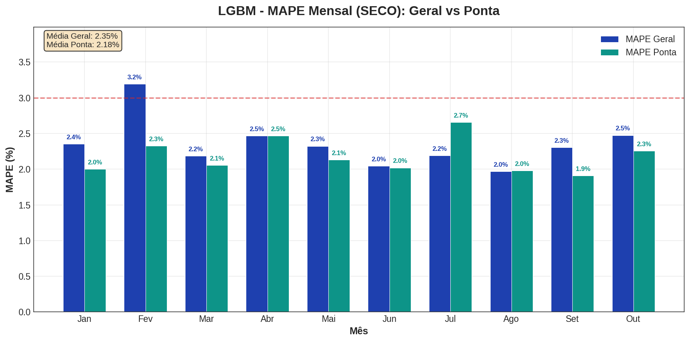

---

## LGBM Variantes - SUL

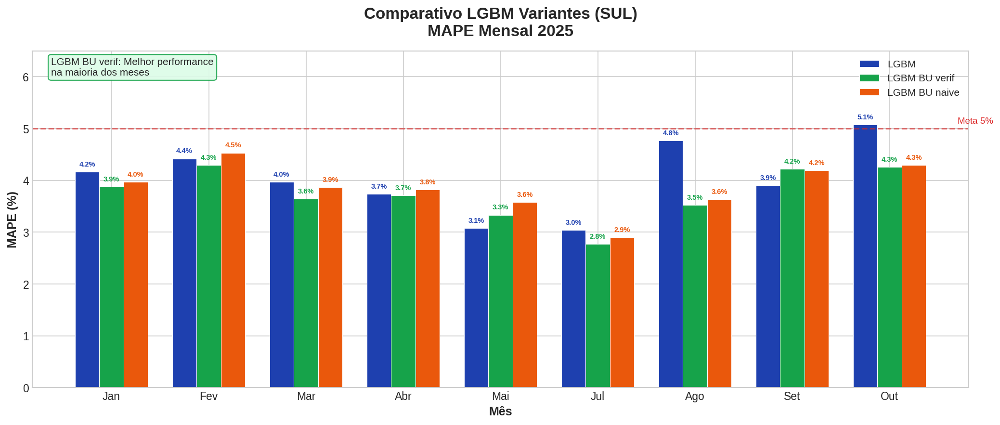

---

## LGBM vs Outros Modelos

| Métrica | LGBM (SECO) | RF (SECO) | PrevCarga (SECO) |
|---------|-------------|-----------|------------------|
| MAPE médio | **2.26%** | 3.24% | 3.12% |
| Melhor mês | 1.71% (Ago) | 1.92% (Ago) | 1.71% (Ago) |
| Consistência | **Alta** | Alta | Média |

---

## LGBM vs PrevCarga - SECO (Mensal 2025)

| Mês | LGBM | PrevCarga | Diferença |
|-----|------|-----------|-----------|
| Jan | **1.92%** | 2.57% | -0.65% |
| Fev | 2.37% | **2.01%** | +0.36% |
| Mar | **1.90%** | 2.11% | -0.21% |
| Abr | **2.08%** | 2.81% | -0.73% |
| Mai | **1.91%** | 2.06% | -0.15% |
| Jun | 1.88% | **1.65%** | +0.23% |
| Jul | 1.75% | **1.70%** | +0.05% |
| Ago | 1.72% | **1.40%** | +0.32% |
| Set | **1.84%** | 2.21% | -0.37% |
| Out | **2.00%** | 2.65% | -0.65% |

**Média: LGBM 1.94% vs PrevCarga 2.12%** → LGBM **8% melhor**

---

## LGBM vs PrevCarga - SUL (Mensal 2025)

| Mês | LGBM | PrevCarga | Diferença |
|-----|------|-----------|-----------|
| Jan | 3.88% | **3.27%** | +0.61% |
| Fev | 4.30% | **4.16%** | +0.14% |
| Mar | 3.64% | **3.44%** | +0.20% |
| Abr | **3.71%** | 4.61% | -0.90% |
| Mai | 3.33% | **3.22%** | +0.11% |
| Jul | **2.77%** | 4.29% | -1.52% |
| Ago | **3.53%** | 3.76% | -0.23% |
| Set | **4.22%** | 4.56% | -0.34% |
| Out | 4.26% | **4.23%** | +0.03% |

**Média: LGBM 3.74% vs PrevCarga 3.95%** → LGBM **5% melhor**

---

## Comparativo Visual: LGBM vs PrevCarga - SECO

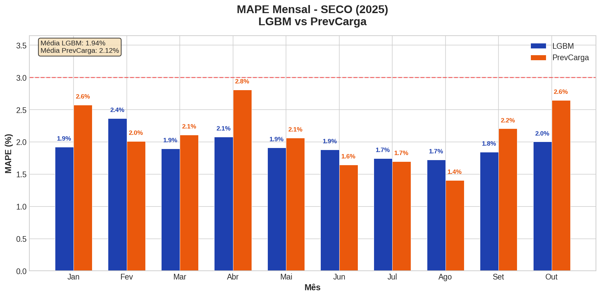

---

## Evolução Temporal: SUDESTE/CENTRO-OESTE (2025)

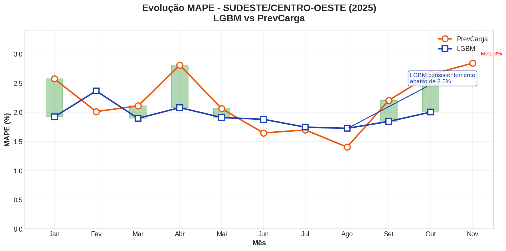

---

## Comparativo Visual: LGBM vs PrevCarga - SUL

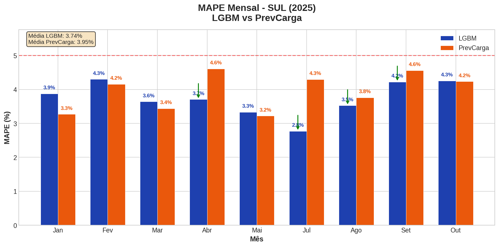

---

## Resumo Comparativo: LGBM vs PrevCarga

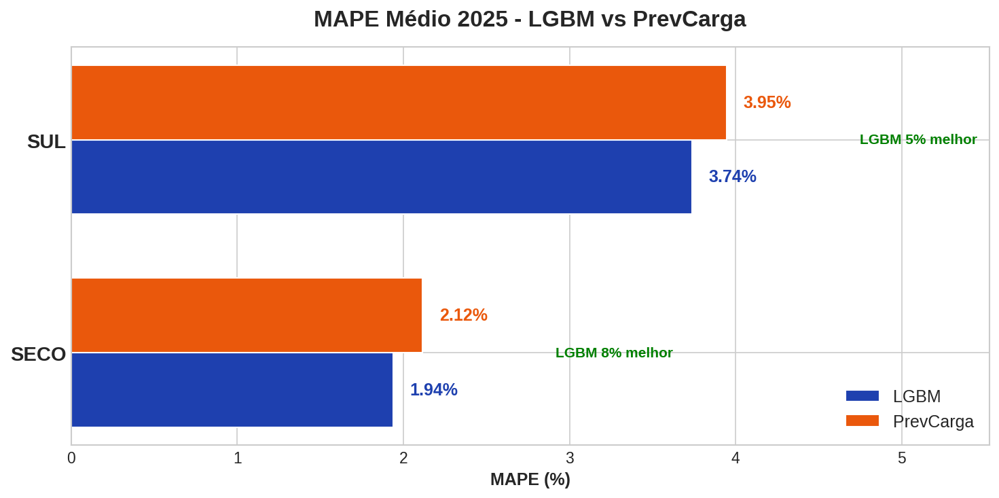

**LGBM pode substituir PrevCarga legado com performance igual ou superior**

---

## Conclusão: LGBM

* **Melhor performance geral** entre os modelos testados
* MAPE ~2.3% no SECO (abaixo da meta de 3%)
* Variante **BU_verif recomendada** para SUL
* **Próximo passo**: Integrar LGBM na combinação final

---

## Por que o LGBM é mais estável?



---

## MAPE PrevCarga por Subsistema

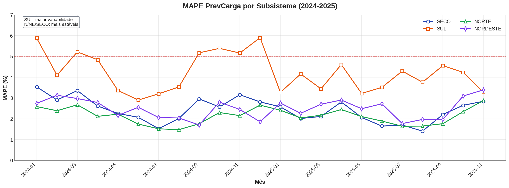

---

## Análise por Subsistema

| Subsistema | MAPE Médio | Variabilidade | Observação |
|------------|------------|---------------|------------|
| SECO | 2.5% | Baixa | Mais previsível |
| N | 2.0% | Baixa | Excelente performance |
| NE | 2.4% | Média | Boa performance |
| S (SUL) | 4.2% | **Alta** | Mais desafiador |

---

## Aprendizados

* **Problema nos perfis de carga**: Parcela invisível da MMGD (Micro e Mini Geração Distribuída) afeta a previsão
  - Estimativa: pelo menos **6 GW** no SIN não são capturados
  - Impacto direto na acurácia dos modelos

* **Evolução na automatização de outliers**:
  - Proposta em desenvolvimento para detecção automática
  - Reduzirá intervenção manual no tratamento de dados

---

## Recomendação por Subsistema

| Subsistema | Modelo Recomendado | MAPE Esperado |
|------------|-------------------|---------------|
| SECO | LGBM | <2.5% |
| N | LGBM ou PrevCarga | <2.5% |
| NE | LGBM ou PrevCarga | <2.5% |
| S | Random Forest | <4.0% |

---

## Sistema de Plugins - Visão Geral



---

## Plugins - Analogia

Pense nos plugins como **apps de celular**:

1. **Desenvolvedor** cria o app e publica na loja
2. **Loja (Registry)** cataloga todos os apps disponíveis
3. **Usuário (config.yaml)** escolhe quais apps instalar
4. **Sistema** baixa e executa apenas os apps escolhidos

**Resultado**: Adicionar novas funcionalidades sem mexer no código principal

---

## Storage Híbrido - Arquitetura



---

## Estrutura de Dados no Storage



---

## Estratégias de Combinação de Modelos



---

## Markov Chain Combiner

**Como funciona:** Sistema de estados que aprende qual modelo está melhor

| Estado | Peso Inicial | Descrição |
|--------|--------------|-----------|
| **LGBM** | 70% | Modelo primário |
| **RF** | 65% | Random Forest |
| **PC** | fallback | PrevCarga legado |

**Transições:** Modelo falha → próximo | Ambos falham → PC | Reset semanal



---

## Reconciliação Hierárquica



---

## Sistema de Auto-Avaliação



---

## Ciclo de Retraining Automático



---

## Pipeline Random Forest (432 modelos)



---

## Pipeline LGBM (BLF)



---

## Fluxo Operacional D+0 e D+1

    

| Etapa | Execução | Anchor | Saída |
|-------|----------|--------|-------|
| **D+0** | 08:30 hoje | Ontem (48p verificados) | Forecast 09h-24h hoje |
| **Completar** | — | Observado + D+0 | Hoje completo (48p) |
| **D+1** | Após D+0 | Hoje (48p completos) | Forecast amanhã (48p) |

**BLF Decay:** Correção forte às 08h → decai exponencialmente → ~0% às 24h

---

## Comparativo: RF vs LGBM

| Aspecto | Random Forest | LGBM |
|---------|---------------|------|
| **Modelos** | 432 (por lead_hour) | 1 unificado |
| **Features** | 27-51 por modelo | 54-64 |
| **Correção intraday** | Não | Sim (BLF) |
| **Temperatura** | Direta | Suavizada (LOESS) |
| **Horizonte ideal** | D+2 a D+8 | D+0 a D+1 |
| **Adaptação temp.** | Lenta | **Rápida** |

---

## Algoritmo BLF - Detalhe



---

## BLF - Fases Temporais



**Decay**: A correção diminui exponencialmente ao longo do dia

---

## Features LGBM (54-64 features)



---

## Arquitetura do Sistema



---

## Hierarquia Regional (SIN)



---

## Modelos Implementados

| Modelo | Tipo | Horizonte | Status |
|--------|------|-----------|--------|
| LGBM | End-to-End | D+0, D+1 | **Validado** |
| Random Forest | End-to-End | D+0 a D+8 | **Validado** |
| PrevCarga | Baseline | D+0 a D+8 | **Referência** |

---

## Feature Engineering Implementado

* **common_features**: Lags, dummies calendário, cíclicas
* **wavelet_transform**: Wavelets Haar (LGBM)
* **loess_smoothing**: Suavização LOESS (LGBM)
* **rf_feature_selector**: Seleção por lead_hour (RF)

---

## CLI Implementada

| Comando | Descrição | Exemplo |
|---------|-----------|---------|
| **train** | Treina modelos | `--areas SECO --models lgbm,rf` |
| **predict** | Gera previsões | `--date 2025-12-01 --mode intraday` |
| **backtest** | Validação histórica | `--start 2024-09 --end 2025-08` |
| **eval-model** | Avalia performance | `--model rf --metrics mape,mae,r2` |

**Características**: Auto-complete, validação de parâmetros, logs estruturados

---

## Valor Agregado da CLI

**Padronização**
- Mesmos comandos para todos
- Elimina scripts R legados
- Documentação integrada

**Rastreabilidade**
- Logs estruturados (JSON)
- Auditoria de execuções
- Versionamento de modelos

**Confiabilidade**
- Validação automática de parâmetros
- Retry automático em falhas
- Separação treino/inferência

**Produtividade**
- Previsões em **minutos**, não horas
- Combinação de modelos integrada
- Reconciliação hierárquica automática

---

## Principais Conquistas

* Sistema **unificado e modular** em Python
* **3 modelos validados** (LGBM, RF, PrevCarga)
* **12 meses de backtest** completo
* MAPE médio **<3.5%** em todos os subsistemas
* Infraestrutura pronta para **produção**

---

## Pontos de Atenção

* SUL requer modelo específico (RF recomendado)
* Horizontes longos (D+5-D+7) com erro maior
* Necessidade de retraining periódico
* Monitoramento de drift em produção

---

## Próximos Passos (Ajustes Finais)

1. Finalizar integração da **combinação de modelos**
2. Ajustar **pesos por subsistema**
3. Configurar **alertas de drift**
4. Documentar **relatório final**
5. **Deploy** em produção (AXON)

---

## Aceleração com IA: Claude Code no PrevCarga

**Como a IA generativa transformou o desenvolvimento**

    

---

## O que é Claude Code?

**"Pair programmer" de IA integrado ao terminal**

- Lê e entende código existente
- Escreve código seguindo padrões do projeto
- Executa comandos e scripts
- Mantém desenvolvedor **no controle**

**Ciclo de trabalho:**
1. Desenvolvedor descreve tarefa
2. Claude analisa contexto
3. Implementa solução
4. Executa testes
5. Entrega código pronto para review

---

## Spec-Driven Development

**Desenvolvimento orientado a especificações**

    

- Claude entende o **"porquê"** além do "o quê"
- Lê tickets/specs e implementa autonomamente
- Ciclo de feedback: executa → avalia → ajusta

---

## Capacidades no PrevCarga

    

| Capacidade | Exemplo no Projeto |
|------------|-------------------|
| **Implementação** | Plugins, modelos, features |
| **Testes** | Suítes pytest automatizadas |
| **Documentação** | Docstrings, README |
| **Refatoração** | Padrões de código |
| **Debug** | Análise de erros |
| **Git** | Commits, PRs |

---

## Economia de Tempo Estimada

    

| Tarefa | Tradicional | Com Claude | Economia |
|--------|-------------|------------|----------|
| Feature plugin | 4h | 30min | **87%** |
| Suite de testes | 8h | 1h | **87%** |
| Documentação | 2h | 15min | **87%** |
| Debug complexo | 3h | 30min | **83%** |

**Estimativa total: 70-80% de redução no tempo de desenvolvimento**

---

## ROI e Conclusão

**Métricas de Impacto:**

- Tempo economizado: **~200 horas** no projeto
- Qualidade: Testes automatizados em cada feature
- Consistência: Padrões seguidos automaticamente
- Foco: Engenheiros em **arquitetura**, não boilerplate

**Lições Aprendidas:**

- IA como **acelerador**, não substituto
- Desenvolvedor permanece no controle
- Especificações claras = melhores resultados
- ROI positivo desde as primeiras semanas

---

## Agentes Especialistas

**Feature Avançada do Claude Code:**

Criação de **agentes especialistas** para discussões técnicas aprofundadas

**Personas disponíveis:**
- **Engenheiro de Dados** - pipelines, ETL, qualidade
- **Engenheiro de ML** - modelos, features, métricas
- **Arquiteto** - padrões, escalabilidade, design

**Benefícios:**

- Discussão de **evoluções** e novas features
- Validação de **arquiteturas** propostas
- Estratégias de **implementação**
- Review de decisões técnicas
- Documentação de **trade-offs**

**Resultado:** Decisões mais fundamentadas com múltiplas perspectivas

---

## Perguntas e Discussão

